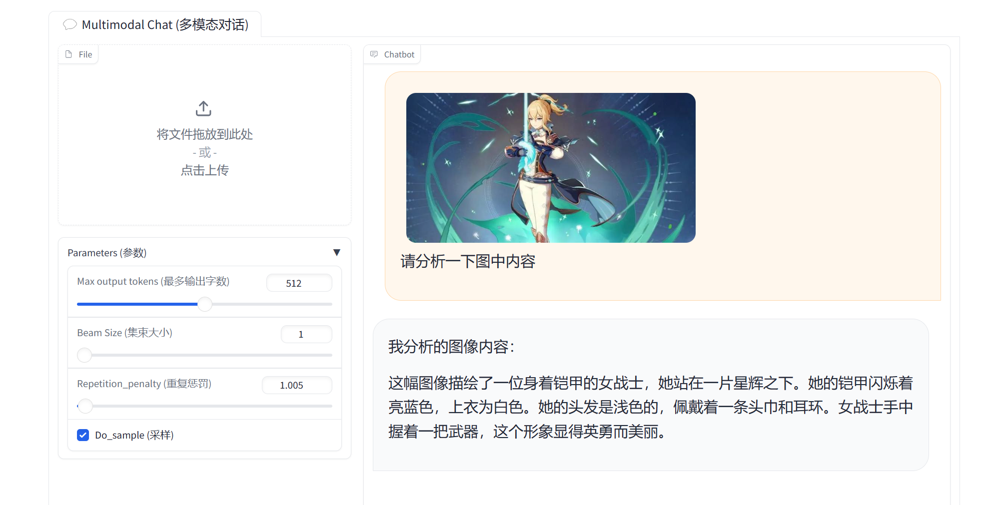

## Cli-demo


# 进阶作业

```python
import os
os.environ["HF_ENDPOINT"] = "https://hf-mirror.com"
```

## lagent


## Hugging Face

```bash
export HF_ENDPOINT=https://hf-mirror.com

import os
os.environ["HF_ENDPOINT"] = "https://hf-mirror.com"
```


## 浦语 灵笔

### 1. 图文创作

```
python /root/demo/InternLM-XComposer/examples/gradio_demo_composition.py --code_path /root/models/internlm-xcomposer2-7b --private --num_gpus 1 --port 6006
```


```
ssh -CNg -L 6006:127.0.0.1:6006 root@ssh.intern-ai.org.cn -p 41783

nLHFNnx5lSaY1i1r
```


### 2. 视觉问答

```
cd /root/demo/InternLM-XComposer
python /root/demo/InternLM-XComposer/examples/gradio_demo_chat.py  --code_path /root/models/internlm-xcomposer2-vl-7b --private --num_gpus 1 --port 6006
```

