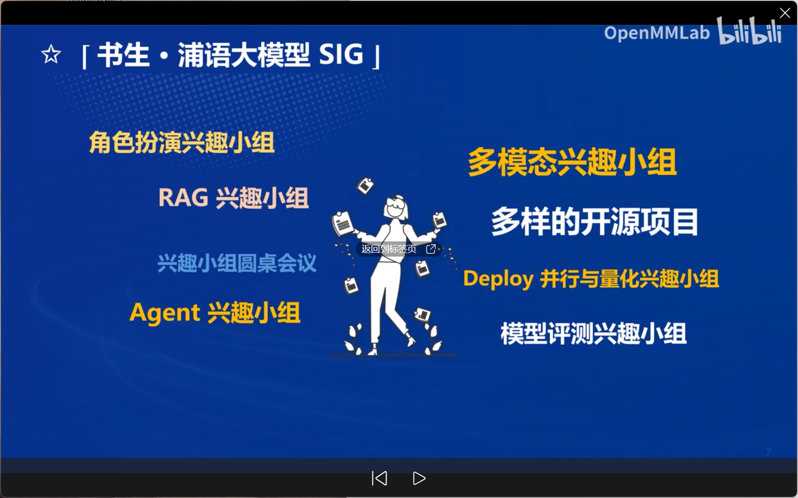
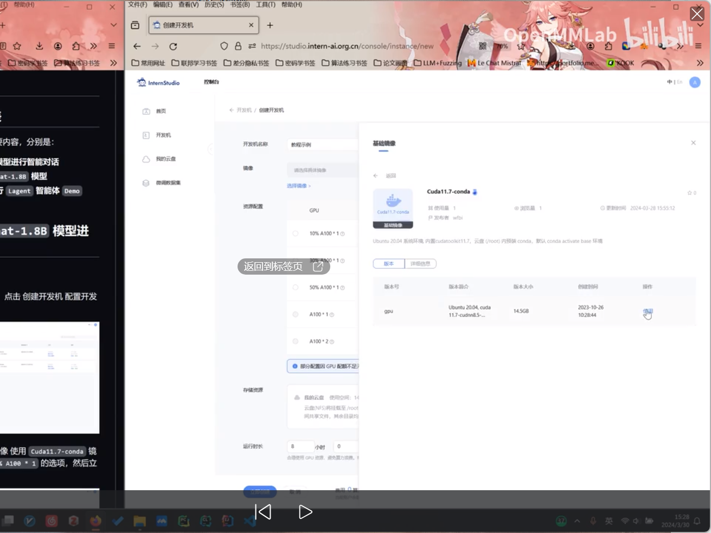
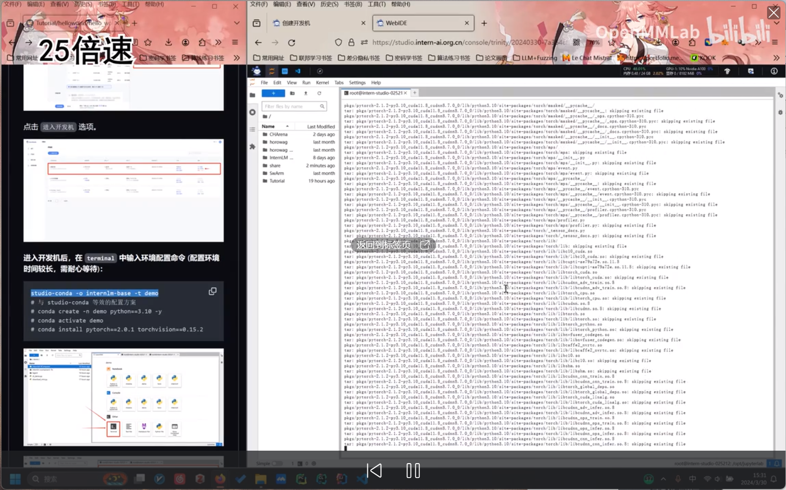

兴趣小组：



## 趣味demo：





**进入开发机后，在 `terminal` 中输入环境配置命令 (配置环境时间较长，需耐心等待)：**

```
studio-conda -o internlm-base -t demo
# 与 studio-conda 等效的配置方案
# conda create -n demo python==3.10 -y
# conda activate demo
# conda install pytorch==2.0.1 torchvision==0.15.2 torchaudio==2.0.2 pytorch-cuda=11.7 -c pytorch -c nvidia
```

配置完成后，进入到新创建的 `conda` 环境之中：

```
conda activate demo
```


输入以下命令，完成环境包的安装：

```
pip install huggingface-hub==0.17.3
pip install transformers==4.34 
pip install psutil==5.9.8
pip install accelerate==0.24.1
pip install streamlit==1.32.2 
pip install matplotlib==3.8.3 
pip install modelscope==1.9.5
pip install sentencepiece==0.1.99
```


### **2.2 下载 `InternLM2-Chat-1.8B` 模型**


按路径创建文件夹，并进入到对应文件目录中：

```
mkdir -p /root/demo
touch /root/demo/cli_demo.py
touch /root/demo/download_mini.py
cd /root/demo
```


通过左侧文件夹栏目，双击进入 `demo` 文件夹。


双击打开 `/root/demo/download_mini.py` 文件，复制以下代码：

```
import os
from modelscope.hub.snapshot_download import snapshot_download

# 创建保存模型目录
os.system("mkdir /root/models")

# save_dir是模型保存到本地的目录
save_dir="/root/models"

snapshot_download("Shanghai_AI_Laboratory/internlm2-chat-1_8b", 
                  cache_dir=save_dir, 
                  revision='v1.1.0')
```


执行命令，下载模型参数文件：

```
python /root/demo/download_mini.py
```


### **2.3 运行 cli_demo**


双击打开 `/root/demo/cli_demo.py` 文件，复制以下代码：

```
import torch
from transformers import AutoTokenizer, AutoModelForCausalLM


model_name_or_path = "/root/models/Shanghai_AI_Laboratory/internlm2-chat-1_8b"

tokenizer = AutoTokenizer.from_pretrained(model_name_or_path, trust_remote_code=True, device_map='cuda:0')
model = AutoModelForCausalLM.from_pretrained(model_name_or_path, trust_remote_code=True, torch_dtype=torch.bfloat16, device_map='cuda:0')
model = model.eval()

system_prompt = """You are an AI assistant whose name is InternLM (书生·浦语).
- InternLM (书生·浦语) is a conversational language model that is developed by Shanghai AI Laboratory (上海人工智能实验室). It is designed to be helpful, honest, and harmless.
- InternLM (书生·浦语) can understand and communicate fluently in the language chosen by the user such as English and 中文.
"""

messages = [(system_prompt, '')]

print("=============Welcome to InternLM chatbot, type 'exit' to exit.=============")

while True:
    input_text = input("\nUser  >>> ")
    input_text = input_text.replace(' ', '')
    if input_text == "exit":
        break

    length = 0
    for response, _ in model.stream_chat(tokenizer, input_text, messages):
        if response is not None:
            print(response[length:], flush=True, end="")
            length = len(response)
```


输入命令，执行 Demo 程序：

```
conda activate demo
python /root/demo/cli_demo.py
```


等待模型加载完成，键入内容示例：

```
请创作一个 300 字的小故事
```


## 八戒chat-demo

### 3.2 **配置基础环境**


运行环境命令：

```
conda activate demo
```


使用 `git` 命令来获得仓库内的 Demo 文件：

```
cd /root/
git clone https://gitee.com/InternLM/Tutorial -b camp2
# git clone https://github.com/InternLM/Tutorial -b camp2
cd /root/Tutorial
```


### 3.3 **下载运行 Chat-八戒 Demo**


在 `Web IDE` 中执行 `bajie_download.py`：

```
python /root/Tutorial/helloworld/bajie_download.py
```


待程序下载完成后，输入运行命令：

```
streamlit run /root/Tutorial/helloworld/bajie_chat.py --server.address 127.0.0.1 --server.port 6006
```


待程序运行的同时，对端口环境配置本地 `PowerShell` 。使用快捷键组合 `Windows + R`（Windows 即开始菜单键）打开指令界面，并输入命令，按下回车键。（Mac 用户打开终端即可）

[](https://github.com/InternLM/Tutorial/blob/camp2/helloworld/images/img-8.png)

打开 PowerShell 后，先查询端口，再根据端口键入命令 （例如图中端口示例为 38374）：

[](https://github.com/InternLM/Tutorial/blob/camp2/helloworld/images/img-A.png)

```
# 从本地使用 ssh 连接 studio 端口
# 将下方端口号 38374 替换成自己的端口号
ssh -CNg -L 6006:127.0.0.1:6006 root@ssh.intern-ai.org.cn -p 38374
```


再复制下方的密码，输入到 `password` 中，直接回车：

[](https://github.com/InternLM/Tutorial/blob/camp2/helloworld/images/img-B.png)


打开 [http://127.0.0.1:6006](http://127.0.0.1:6006/) 后，等待加载完成即可进行对话，https://github.com/InternLM/Tutorial/blob/camp2/helloworld/images/img-D.png)