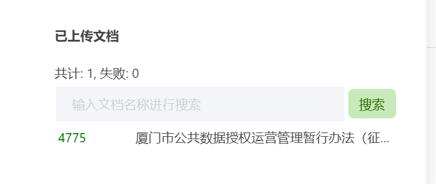
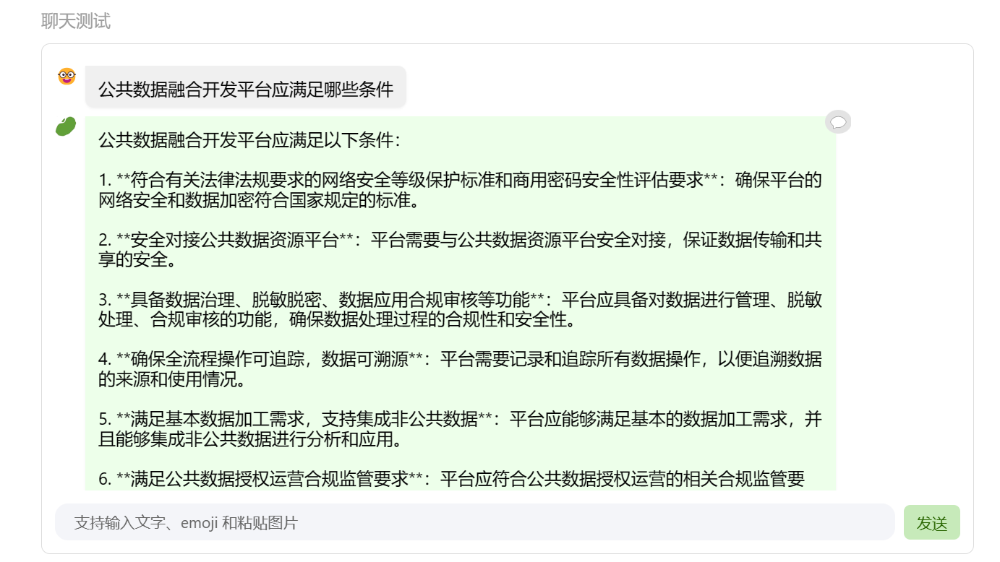
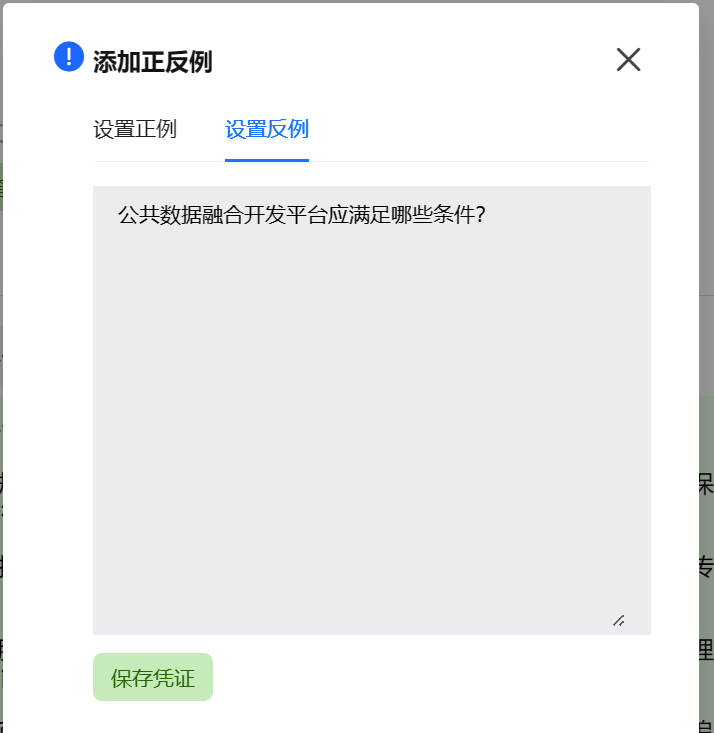
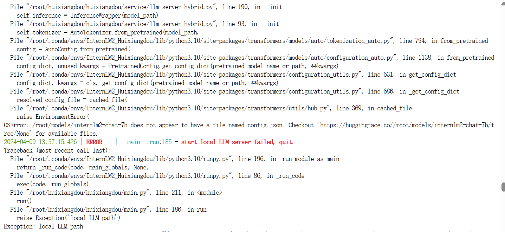
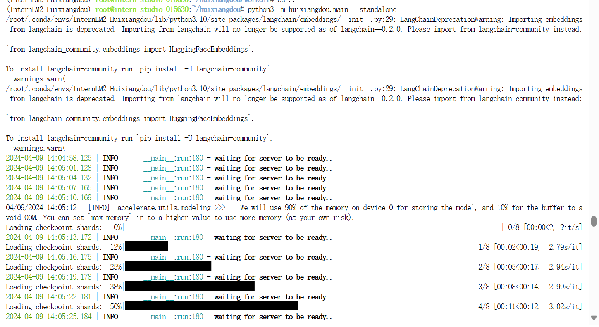
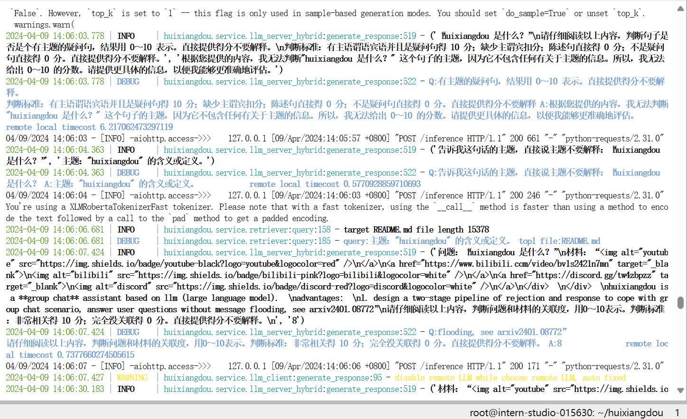
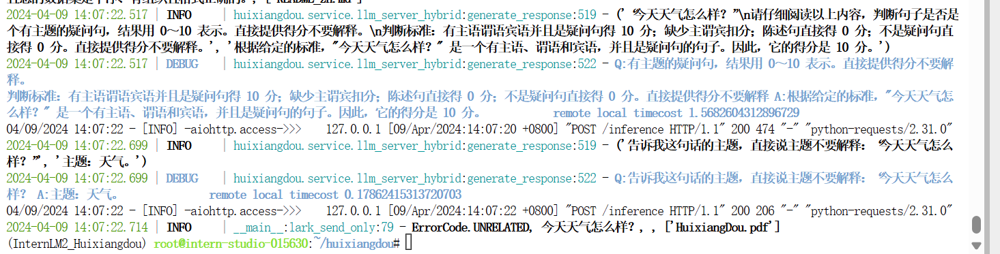
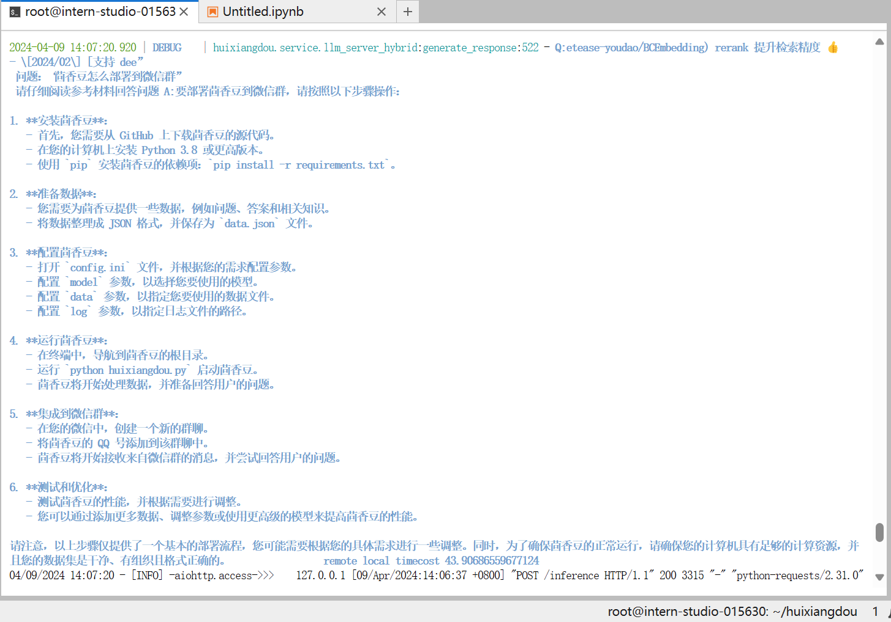

# 基础作业

## 1. 在[茴香豆 Web 版](https://openxlab.org.cn/apps/detail/tpoisonooo/huixiangdou-web)中创建自己领域的知识问答助手

茴香豆：零代码搭建你的 RAG 智能助理

“茴香豆”是一个基于 LLM 的领域知识助手。特点： 应对群聊这类复杂场景，解答用户问题的同时，不会消息泛滥 提出一套解答技术问题的算法 pipeline 部署成本低，只需要 LLM 模型满足 4 个 trait 即可解答大部分用户问题

网址：[应用中心-OpenXLab](https://openxlab.org.cn/apps/detail/tpoisonooo/huixiangdou-web)

创建知识库： course03  123456

上传文档

问答检索测试

设置反例

还是会回答问题

## 2. 在 `InternLM Studio` 上部署茴香豆技术助手

茴香豆：零代码搭建你的 RAG 智能助理

技术路线RAG：

RAG

RAG（Retrieval Augmented Generation）技术，通过检索与用户输入相关的信息片段，并结合***外部知识库***来生成更准确、更丰富的回答。解决 LLMs 在处理知识密集型任务时可能遇到的挑战, 如幻觉、知识过时和缺乏透明、可追溯的推理过程等。提供更准确的回答、降低推理成本、实现外部记忆。

报错，

定位发现，local llm的文件夹我多了一层嵌套

运行结果：

1. 问题：huixiangdou 是什么？

2. 问题：今天天气怎么样？

3. 问题：茴香豆的微信部署

