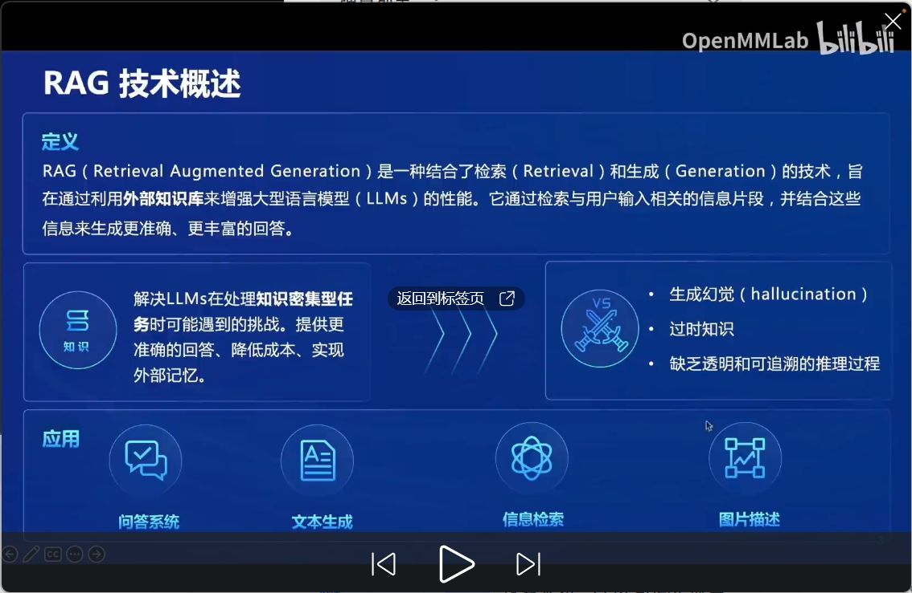
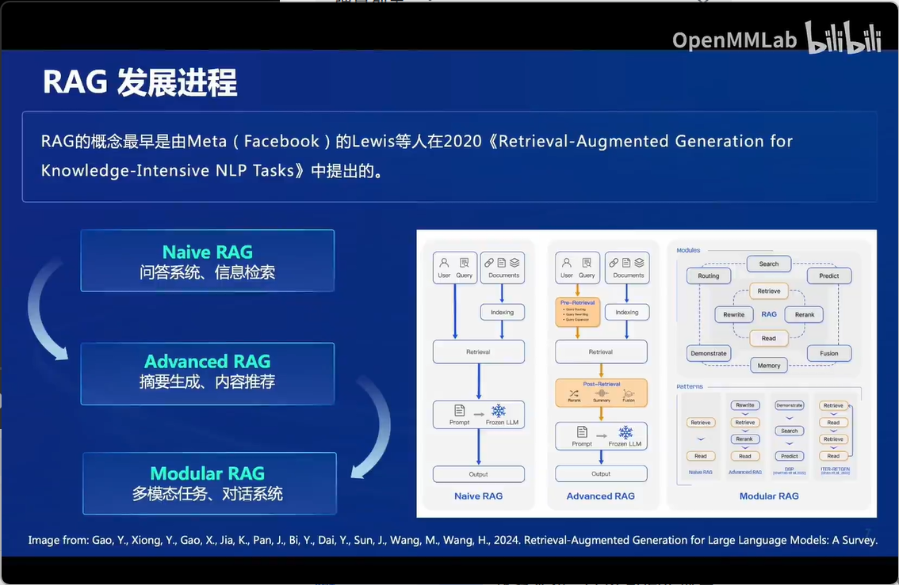
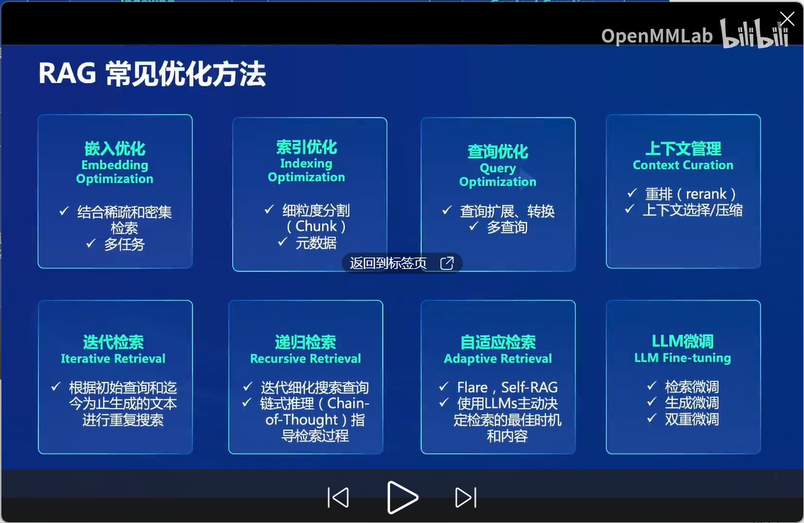
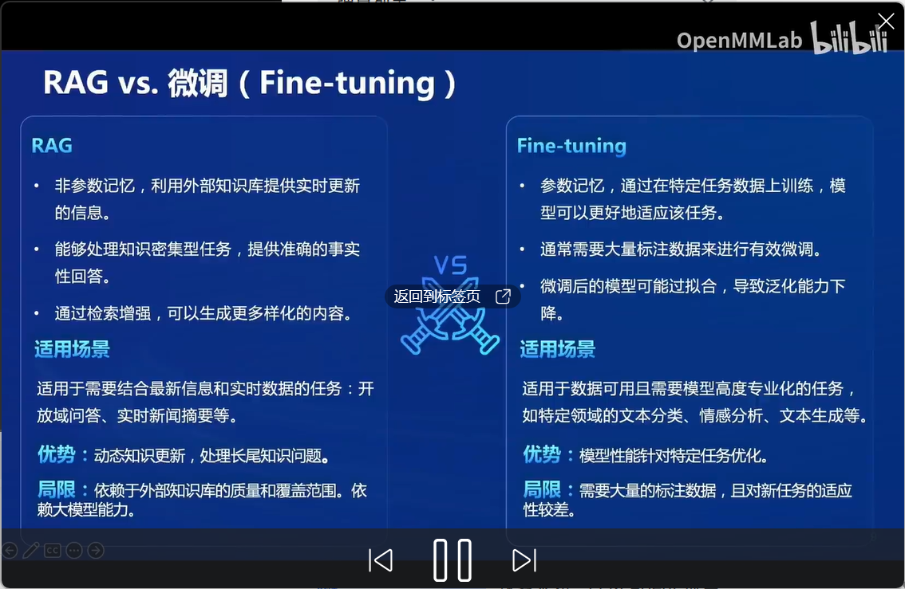
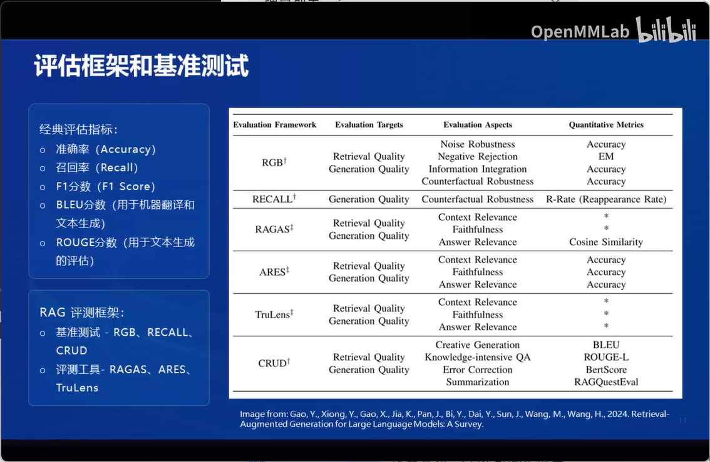
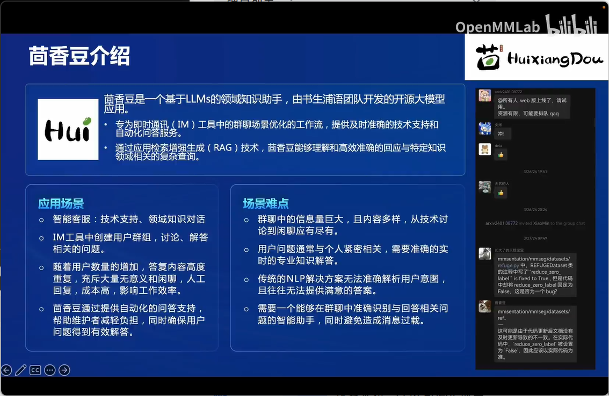
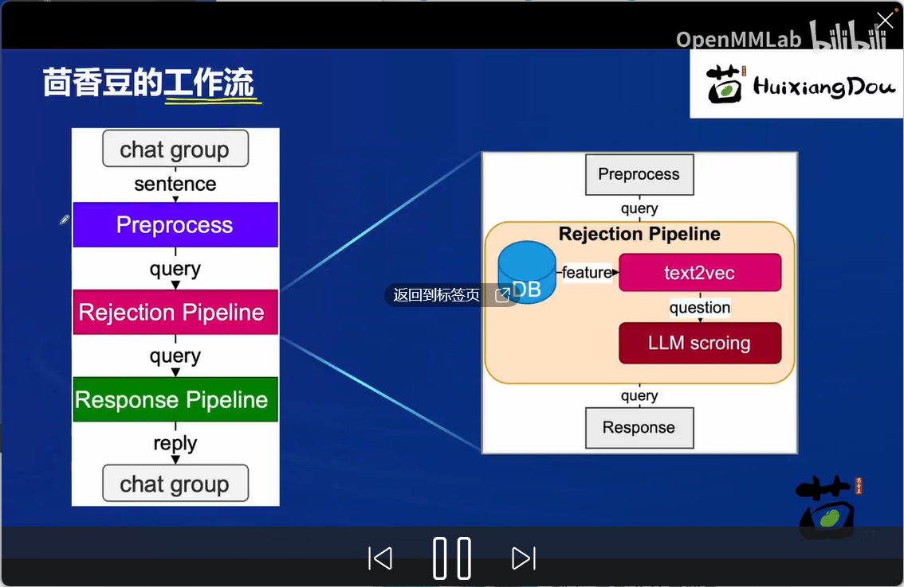
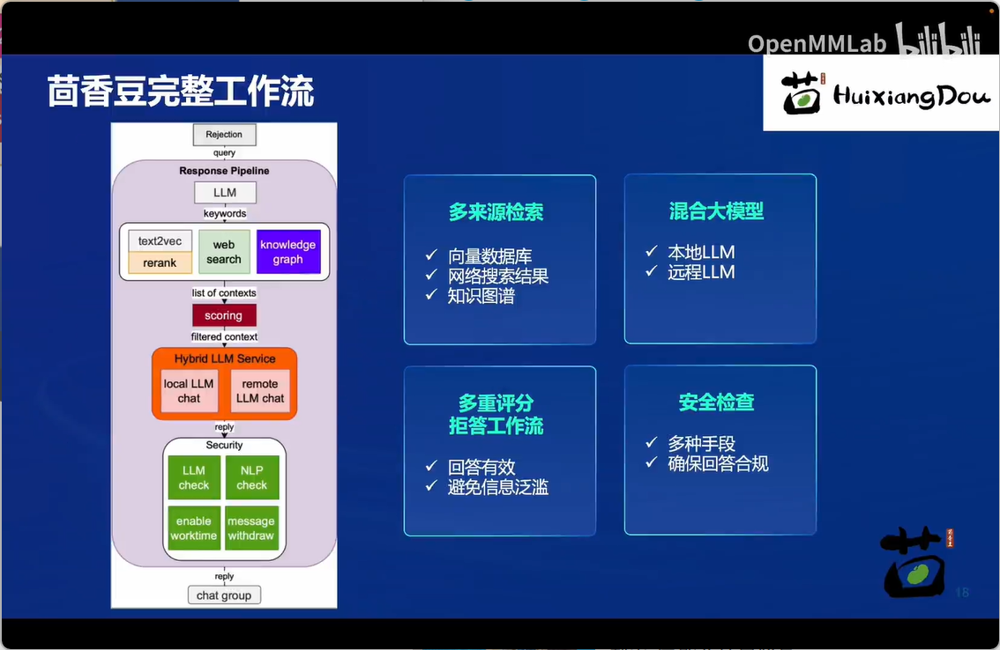
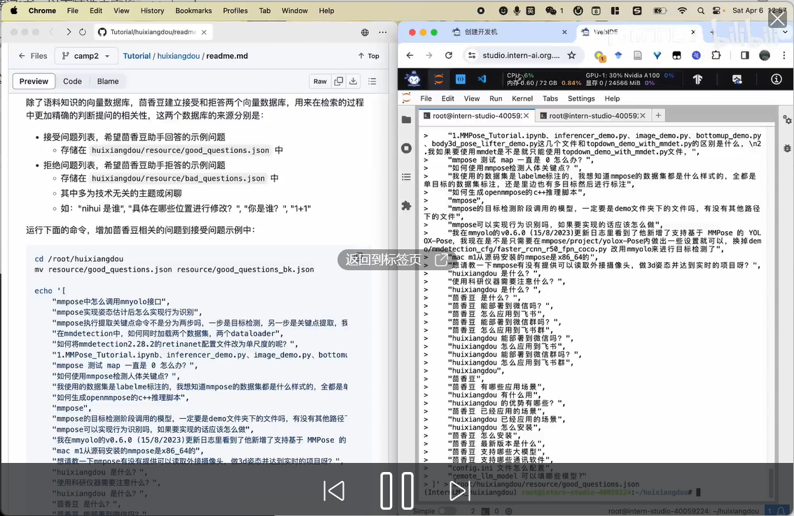

## 目录

1. RAG介绍
2. 茴香豆介绍
3. 实践演示

RAG发展进程

RAG优化方向

展开说说？

RAG与微调的区别

RAG评价指标

茴香豆

茴香豆工作流

茴香豆web版本

[应用中心-OpenXLab](https://openxlab.org.cn/apps/detail/tpoisonooo/huixiangdou-web)

茴香豆-internstudio部署版本

拒答和接受模块也是将问题存储在向量数据库中

-猜测使用相关性搜索

