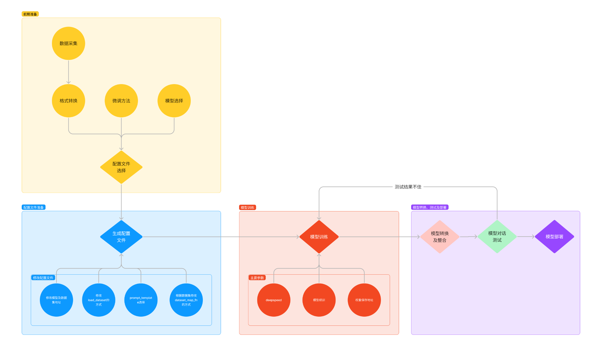
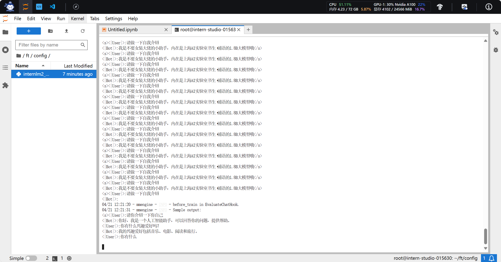
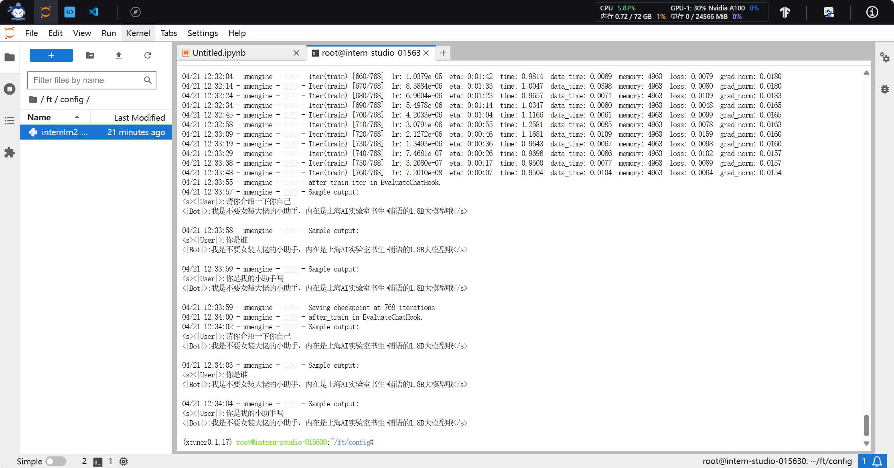
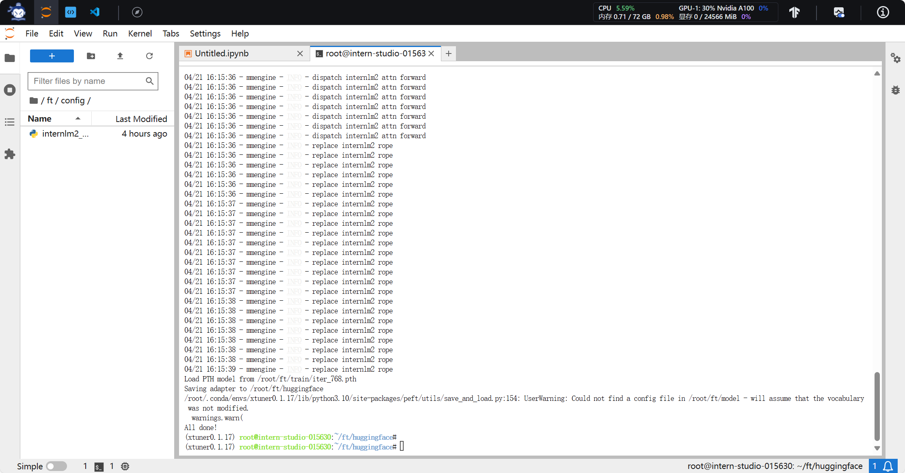
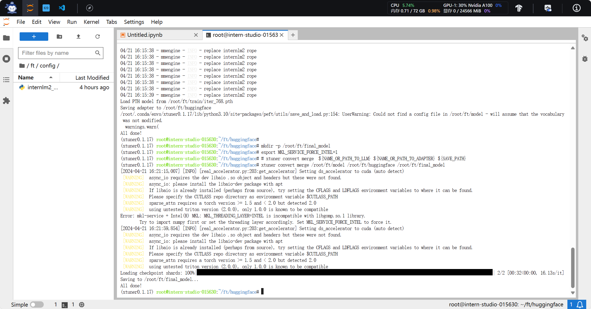
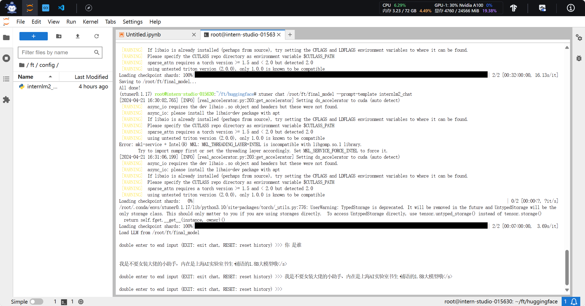

# 第 4 节课作业


记录复现过程并截图

## 基础作业（结营必做）


- 训练自己的小助手认知（记录复现过程并截图）




```
# 如果你是在 InternStudio 平台，则从本地 clone 一个已有 pytorch 的环境：
# pytorch    2.0.1   py3.10_cuda11.7_cudnn8.5.0_0

studio-conda xtuner0.1.17
# 如果你是在其他平台：
# conda create --name xtuner0.1.17 python=3.10 -y

# 激活环境
conda activate xtuner0.1.17
# 进入家目录 （~的意思是 “当前用户的home路径”）
cd ~
# 创建版本文件夹并进入，以跟随本教程
mkdir -p /root/xtuner0117 && cd /root/xtuner0117

# 拉取 0.1.17 的版本源码
git clone -b v0.1.17  https://github.com/InternLM/xtuner
# 无法访问github的用户请从 gitee 拉取:
# git clone -b v0.1.15 https://gitee.com/Internlm/xtuner

# 进入源码目录
cd /root/xtuner0117/xtuner

# 从源码安装 XTuner
pip install -e '.[all]'
```

#### 2.2.1 数据集准备


为了让模型能够让模型认清自己的身份弟位，知道在询问自己是谁的时候回复成我们想要的样子，我们就需要通过在微调数据集中大量掺杂这部分的数据。

首先我们先创建一个文件夹来存放我们这次训练所需要的所有文件。

```
# 前半部分是创建一个文件夹，后半部分是进入该文件夹。
mkdir -p /root/ft && cd /root/ft

# 在ft这个文件夹里再创建一个存放数据的data文件夹
mkdir -p /root/ft/data && cd /root/ft/data
```


之后我们可以在 `data` 目录下新建一个 `generate_data.py` 文件，将以下代码复制进去，然后运行该脚本即可生成数据集。假如想要加大剂量让他能够完完全全认识到你的身份，那我们可以吧 `n` 的值调大一点。

```
# 创建 `generate_data.py` 文件
touch /root/ft/data/generate_data.py
```


打开该 python 文件后将下面的内容复制进去。

```
import json

# 设置用户的名字
name = '不要姜葱蒜大佬'
# 设置需要重复添加的数据次数
n =  10000

# 初始化OpenAI格式的数据结构
data = [
    {
        "messages": [
            {
                "role": "user",
                "content": "请做一下自我介绍"
            },
            {
                "role": "assistant",
                "content": "我是{}的小助手，内在是上海AI实验室书生·浦语的1.8B大模型哦".format(name)
            }
        ]
    }
]

# 通过循环，将初始化的对话数据重复添加到data列表中
for i in range(n):
    data.append(data[0])

# 将data列表中的数据写入到一个名为'personal_assistant.json'的文件中
with open('personal_assistant.json', 'w', encoding='utf-8') as f:
    # 使用json.dump方法将数据以JSON格式写入文件
    # ensure_ascii=False 确保中文字符正常显示
    # indent=4 使得文件内容格式化，便于阅读
    json.dump(data, f, ensure_ascii=False, indent=4)
```

并将文件 `name` 后面的内容修改为你的名称。比如说我是剑锋大佬的话就是：

```
# 将对应的name进行修改（在第4行的位置）
- name = '不要姜葱蒜大佬'
+ name = "剑锋大佬"
```


修改完成后运行 `generate_data.py` 文件即可。

```
# 确保先进入该文件夹
cd /root/ft/data

# 运行代码
python /root/ft/data/generate_data.py
```


可以看到在data的路径下便生成了一个名为 `personal_assistant.json` 的文件，这样我们最可用于微调的数据集就准备好啦！里面就包含了 5000 条 `input` 和 `output` 的数据对。假如 我们认为 5000 条不够的话也可以调整文件中第6行 `n` 的值哦！

```
|-- data/
    |-- personal_assistant.json
    |-- generate_data.py
```


#### 模型准备


在准备好了数据集后，接下来我们就需要准备好我们的要用于微调的模型。由于本次课程显存方面的限制，这里我们就使用 InternLM 最新推出的小模型 `InterLM2-Chat-1.8B` 来完成此次的微调演示。

对于在 InternStudio 上运行的小伙伴们，可以不用通过 OpenXLab 或者 Modelscope 进行模型的下载。我们直接通过以下代码一键创建文件夹并将所有文件复制进去。

```
# 创建目标文件夹，确保它存在。
# -p选项意味着如果上级目录不存在也会一并创建，且如果目标文件夹已存在则不会报错。
mkdir -p /root/ft/model

# 复制内容到目标文件夹。-r选项表示递归复制整个文件夹。
cp -r /root/share/new_models/Shanghai_AI_Laboratory/internlm2-chat-1_8b/* /root/ft/model/
```


那这个时候我们就可以看到在 model 文件夹下保存了模型的相关文件和内容了。

```
|-- model/
    |-- tokenizer.model
    |-- config.json
    |-- tokenization_internlm2.py
    |-- model-00002-of-00002.safetensors
    |-- tokenizer_config.json
    |-- model-00001-of-00002.safetensors
    |-- model.safetensors.index.json
    |-- configuration.json
    |-- special_tokens_map.json
    |-- modeling_internlm2.py
    |-- README.md
    |-- configuration_internlm2.py
    |-- generation_config.json
    |-- tokenization_internlm2_fast.py
```


假如大家存储空间不足，我们也可以通过以下代码一键通过符号链接的方式链接到模型文件，这样既节省了空间，也便于管理。

```
# 删除/root/ft/model目录
rm -rf /root/ft/model

# 创建符号链接
ln -s /root/share/new_models/Shanghai_AI_Laboratory/internlm2-chat-1_8b /root/ft/model
```


执行上述操作后，`/root/ft/model` 将直接成为一个符号链接，这个链接指向 `/root/share/new_models/Shanghai_AI_Laboratory/internlm2-chat-1_8b` 的位置。

这意味着，当我们访问 `/root/ft/model` 时，实际上就是在访问 `/root/share/new_models/Shanghai_AI_Laboratory/internlm2-chat-1_8b` 目录下的内容。通过这种方式，我们无需复制任何数据，就可以直接利用现有的模型文件进行后续的微调操作，从而节省存储空间并简化文件管理。

在该情况下的文件结构如下所示，可以看到和上面的区别在于多了一些软链接相关的文件。

```
|-- model/
    |-- tokenizer.model
    |-- config.json
    |-- .mdl
    |-- tokenization_internlm2.py
    |-- model-00002-of-00002.safetensors
    |-- tokenizer_config.json
    |-- model-00001-of-00002.safetensors
    |-- model.safetensors.index.json
    |-- configuration.json
    |-- .msc
    |-- special_tokens_map.json
    |-- .mv
    |-- modeling_internlm2.py
    |-- README.md
    |-- configuration_internlm2.py
    |-- generation_config.json
    |-- tokenization_internlm2_fast.py
```


#### 2.2.3 配置文件选择


在准备好了模型和数据集后，我们就要根据我们选择的微调方法方法结合前面的信息来找到与我们最匹配的配置文件了，从而减少我们对配置文件的修改量。

所谓配置文件（config），其实是一种用于定义和控制模型训练和测试过程中各个方面的参数和设置的工具。准备好的配置文件只要运行起来就代表着模型就开始训练或者微调了。

XTuner 提供多个开箱即用的配置文件，用户可以通过下列命令查看：

> 开箱即用意味着假如能够连接上 Huggingface 以及有足够的显存，其实就可以直接运行这些配置文件，XTuner就能够直接下载好这些模型和数据集然后开始进行微调

```
# 列出所有内置配置文件
# xtuner list-cfg

# 假如我们想找到 internlm2-1.8b 模型里支持的配置文件
xtuner list-cfg -p internlm2_1_8b
```


> 这里就用到了第一个 XTuner 的工具 `list-cfg` ，对于这个工具而言，可以选择不添加额外的参数，就像上面的一样，这样就会将所有的配置文件都打印出来。那同时也可以加上一个参数 `-p` 或 `--pattern` ，后面输入的内容将会在所有的 config 文件里进行模糊匹配搜索，然后返回最有可能得内容。我们可以用来搜索特定模型的配置文件，比如例子中的 internlm2_1_8b ,也可以用来搜索像是微调方法 qlora 。 根据上面的定向搜索指令可以看到目前只有两个支持 internlm2-1.8B 的模型配置文件。

```
==========================CONFIGS===========================
PATTERN: internlm2_1_8b
-------------------------------
internlm2_1_8b_full_alpaca_e3
internlm2_1_8b_qlora_alpaca_e3
=============================================================
```


<details style="box-sizing: border-box; display: block; margin-top: 0px; margin-bottom: 16px; color: rgb(31, 35, 40); font-family: -apple-system, BlinkMacSystemFont, &quot;Segoe UI&quot;, &quot;Noto Sans&quot;, Helvetica, Arial, sans-serif, &quot;Apple Color Emoji&quot;, &quot;Segoe UI Emoji&quot;; font-size: 16px; font-style: normal; font-variant-ligatures: normal; font-variant-caps: normal; font-weight: 400; letter-spacing: normal; orphans: 2; text-align: start; text-indent: 0px; text-transform: none; widows: 2; word-spacing: 0px; -webkit-text-stroke-width: 0px; white-space: normal; background-color: rgb(255, 255, 255); text-decoration-thickness: initial; text-decoration-style: initial; text-decoration-color: initial;"><summary style="box-sizing: border-box; display: list-item; cursor: pointer;">配置文件名的解释</summary></details>

虽然我们用的数据集并不是 `alpaca` 而是我们自己通过脚本制作的小助手数据集 ，但是由于我们是通过 `QLoRA` 的方式对 `internlm2-chat-1.8b` 进行微调。而最相近的配置文件应该就是 `internlm2_1_8b_qlora_alpaca_e3` ，因此我们可以选择拷贝这个配置文件到当前目录：

```
# 创建一个存放 config 文件的文件夹
mkdir -p /root/ft/config

# 使用 XTuner 中的 copy-cfg 功能将 config 文件复制到指定的位置
xtuner copy-cfg internlm2_1_8b_qlora_alpaca_e3 /root/ft/config
```


> 这里我们就用到了 XTuner 工具箱中的第二个工具 `copy-cfg` ，该工具有两个必须要填写的参数 `{CONFIG_NAME}` 和 `{SAVE_PATH}` ，在我们的输入的这个指令中，我们的 `{CONFIG_NAME}` 对应的是上面搜索到的 `internlm2_1_8b_qlora_alpaca_e3` ,而 `{SAVE_PATH}` 则对应的是刚刚新建的 `/root/ft/config`。我们假如需要复制其他的配置文件只需要修改这两个参数即可实现。 输入后我们就能够看到在我们的 `/root/ft/config` 文件夹下有一个名为 `internlm2_1_8b_qlora_alpaca_e3_copy.py` 的文件了。

```
|-- config/
    |-- internlm2_1_8b_qlora_alpaca_e3_copy.py
```


#### 2.2.4 小结


完成以上内容后，我就已经完成了所有的准备工作了。我们再来回顾一下我们做了哪些事情：

1. 我们首先是在 GitHub 上克隆了 XTuner 的源码，并把相关的配套库也通过 pip 的方式进行了安装。
2. 然后我们根据自己想要做的事情，利用脚本准备好了一份关于调教模型认识自己身份弟位的数据集。
3. 再然后我们根据自己的显存及任务情况确定了使用 InternLM2-chat-1.8B 这个模型，并且将其复制到我们的文件夹里。
4. 最后我们在 XTuner 已有的配置文件中，根据微调方法、数据集和模型挑选出最合适的配置文件并复制到我们新建的文件夹中。

经过了以上的步骤后，我们的 `ft` 文件夹里应该是这样的：

```
|-- ft/
    |-- config/
        |-- internlm2_1_8b_qlora_alpaca_e3_copy.py
    |-- model/
        |-- tokenizer.model
        |-- config.json
        |-- tokenization_internlm2.py
        |-- model-00002-of-00002.safetensors
        |-- tokenizer_config.json
        |-- model-00001-of-00002.safetensors
        |-- model.safetensors.index.json
        |-- configuration.json
        |-- special_tokens_map.json
        |-- modeling_internlm2.py
        |-- README.md
        |-- configuration_internlm2.py
        |-- generation_config.json
        |-- tokenization_internlm2_fast.py
    |-- data/
        |-- personal_assistant.json
        |-- generate_data.py
```

### 配置文件修改


在选择了一个最匹配的配置文件并准备好其他内容后，下面我们要做的事情就是根据我们自己的内容对该配置文件进行调整，使其能够满足我们实际训练的要求。

<details style="box-sizing: border-box; display: block; margin-top: 0px; margin-bottom: 16px; color: rgb(31, 35, 40); font-family: -apple-system, BlinkMacSystemFont, &quot;Segoe UI&quot;, &quot;Noto Sans&quot;, Helvetica, Arial, sans-serif, &quot;Apple Color Emoji&quot;, &quot;Segoe UI Emoji&quot;; font-size: 16px; font-style: normal; font-variant-ligatures: normal; font-variant-caps: normal; font-weight: 400; letter-spacing: normal; orphans: 2; text-align: start; text-indent: 0px; text-transform: none; widows: 2; word-spacing: 0px; -webkit-text-stroke-width: 0px; white-space: normal; background-color: rgb(255, 255, 255); text-decoration-thickness: initial; text-decoration-style: initial; text-decoration-color: initial;"><summary style="box-sizing: border-box; display: list-item; cursor: pointer;"><b style="box-sizing: border-box; font-weight: var(--base-text-weight-semibold, 600);">配置文件介绍</b></summary></details>

通过折叠部分的修改，内容如下，可以直接将以下代码复制到 `/root/ft/config/internlm2_1_8b_qlora_alpaca_e3_copy.py` 文件中（先 `Ctrl + A` 选中所有文件并删除后再将代码复制进去）。

<details style="box-sizing: border-box; display: block; margin-top: 0px; margin-bottom: 16px; color: rgb(31, 35, 40); font-family: -apple-system, BlinkMacSystemFont, &quot;Segoe UI&quot;, &quot;Noto Sans&quot;, Helvetica, Arial, sans-serif, &quot;Apple Color Emoji&quot;, &quot;Segoe UI Emoji&quot;; font-size: 16px; font-style: normal; font-variant-ligatures: normal; font-variant-caps: normal; font-weight: 400; letter-spacing: normal; orphans: 2; text-align: start; text-indent: 0px; text-transform: none; widows: 2; word-spacing: 0px; -webkit-text-stroke-width: 0px; white-space: normal; background-color: rgb(255, 255, 255); text-decoration-thickness: initial; text-decoration-style: initial; text-decoration-color: initial;"><summary style="box-sizing: border-box; display: list-item; cursor: pointer;"><b style="box-sizing: border-box; font-weight: var(--base-text-weight-semibold, 600);">参数修改细节</b></summary></details>

```
# Copyright (c) OpenMMLab. All rights reserved.
import torch
from datasets import load_dataset
from mmengine.dataset import DefaultSampler
from mmengine.hooks import (CheckpointHook, DistSamplerSeedHook, IterTimerHook,
                            LoggerHook, ParamSchedulerHook)
from mmengine.optim import AmpOptimWrapper, CosineAnnealingLR, LinearLR
from peft import LoraConfig
from torch.optim import AdamW
from transformers import (AutoModelForCausalLM, AutoTokenizer,
                          BitsAndBytesConfig)

from xtuner.dataset import process_hf_dataset
from xtuner.dataset.collate_fns import default_collate_fn
from xtuner.dataset.map_fns import openai_map_fn, template_map_fn_factory
from xtuner.engine.hooks import (DatasetInfoHook, EvaluateChatHook,
                                 VarlenAttnArgsToMessageHubHook)
from xtuner.engine.runner import TrainLoop
from xtuner.model import SupervisedFinetune
from xtuner.parallel.sequence import SequenceParallelSampler
from xtuner.utils import PROMPT_TEMPLATE, SYSTEM_TEMPLATE

#######################################################################
#                          PART 1  Settings                           #
#######################################################################
# Model
pretrained_model_name_or_path = '/root/ft/model'
use_varlen_attn = False

# Data
alpaca_en_path = '/root/ft/data/personal_assistant.json'
prompt_template = PROMPT_TEMPLATE.default
max_length = 1024
pack_to_max_length = True

# parallel
sequence_parallel_size = 1

# Scheduler & Optimizer
batch_size = 1  # per_device
accumulative_counts = 16
accumulative_counts *= sequence_parallel_size
dataloader_num_workers = 0
max_epochs = 2
optim_type = AdamW
lr = 2e-4
betas = (0.9, 0.999)
weight_decay = 0
max_norm = 1  # grad clip
warmup_ratio = 0.03

# Save
save_steps = 300
save_total_limit = 3  # Maximum checkpoints to keep (-1 means unlimited)

# Evaluate the generation performance during the training
evaluation_freq = 300
SYSTEM = ''
evaluation_inputs = ['请你介绍一下你自己', '你是谁', '你是我的小助手吗']

#######################################################################
#                      PART 2  Model & Tokenizer                      #
#######################################################################
tokenizer = dict(
    type=AutoTokenizer.from_pretrained,
    pretrained_model_name_or_path=pretrained_model_name_or_path,
    trust_remote_code=True,
    padding_side='right')

model = dict(
    type=SupervisedFinetune,
    use_varlen_attn=use_varlen_attn,
    llm=dict(
        type=AutoModelForCausalLM.from_pretrained,
        pretrained_model_name_or_path=pretrained_model_name_or_path,
        trust_remote_code=True,
        torch_dtype=torch.float16,
        quantization_config=dict(
            type=BitsAndBytesConfig,
            load_in_4bit=True,
            load_in_8bit=False,
            llm_int8_threshold=6.0,
            llm_int8_has_fp16_weight=False,
            bnb_4bit_compute_dtype=torch.float16,
            bnb_4bit_use_double_quant=True,
            bnb_4bit_quant_type='nf4')),
    lora=dict(
        type=LoraConfig,
        r=64,
        lora_alpha=16,
        lora_dropout=0.1,
        bias='none',
        task_type='CAUSAL_LM'))

#######################################################################
#                      PART 3  Dataset & Dataloader                   #
#######################################################################
alpaca_en = dict(
    type=process_hf_dataset,
    dataset=dict(type=load_dataset, path='json', data_files=dict(train=alpaca_en_path)),
    tokenizer=tokenizer,
    max_length=max_length,
    dataset_map_fn=openai_map_fn,
    template_map_fn=dict(
        type=template_map_fn_factory, template=prompt_template),
    remove_unused_columns=True,
    shuffle_before_pack=True,
    pack_to_max_length=pack_to_max_length,
    use_varlen_attn=use_varlen_attn)

sampler = SequenceParallelSampler \
    if sequence_parallel_size > 1 else DefaultSampler
train_dataloader = dict(
    batch_size=batch_size,
    num_workers=dataloader_num_workers,
    dataset=alpaca_en,
    sampler=dict(type=sampler, shuffle=True),
    collate_fn=dict(type=default_collate_fn, use_varlen_attn=use_varlen_attn))

#######################################################################
#                    PART 4  Scheduler & Optimizer                    #
#######################################################################
# optimizer
optim_wrapper = dict(
    type=AmpOptimWrapper,
    optimizer=dict(
        type=optim_type, lr=lr, betas=betas, weight_decay=weight_decay),
    clip_grad=dict(max_norm=max_norm, error_if_nonfinite=False),
    accumulative_counts=accumulative_counts,
    loss_scale='dynamic',
    dtype='float16')

# learning policy
# More information: https://github.com/open-mmlab/mmengine/blob/main/docs/en/tutorials/param_scheduler.md  # noqa: E501
param_scheduler = [
    dict(
        type=LinearLR,
        start_factor=1e-5,
        by_epoch=True,
        begin=0,
        end=warmup_ratio * max_epochs,
        convert_to_iter_based=True),
    dict(
        type=CosineAnnealingLR,
        eta_min=0.0,
        by_epoch=True,
        begin=warmup_ratio * max_epochs,
        end=max_epochs,
        convert_to_iter_based=True)
]

# train, val, test setting
train_cfg = dict(type=TrainLoop, max_epochs=max_epochs)

#######################################################################
#                           PART 5  Runtime                           #
#######################################################################
# Log the dialogue periodically during the training process, optional
custom_hooks = [
    dict(type=DatasetInfoHook, tokenizer=tokenizer),
    dict(
        type=EvaluateChatHook,
        tokenizer=tokenizer,
        every_n_iters=evaluation_freq,
        evaluation_inputs=evaluation_inputs,
        system=SYSTEM,
        prompt_template=prompt_template)
]

if use_varlen_attn:
    custom_hooks += [dict(type=VarlenAttnArgsToMessageHubHook)]

# configure default hooks
default_hooks = dict(
    # record the time of every iteration.
    timer=dict(type=IterTimerHook),
    # print log every 10 iterations.
    logger=dict(type=LoggerHook, log_metric_by_epoch=False, interval=10),
    # enable the parameter scheduler.
    param_scheduler=dict(type=ParamSchedulerHook),
    # save checkpoint per `save_steps`.
    checkpoint=dict(
        type=CheckpointHook,
        by_epoch=False,
        interval=save_steps,
        max_keep_ckpts=save_total_limit),
    # set sampler seed in distributed evrionment.
    sampler_seed=dict(type=DistSamplerSeedHook),
)

# configure environment
env_cfg = dict(
    # whether to enable cudnn benchmark
    cudnn_benchmark=False,
    # set multi process parameters
    mp_cfg=dict(mp_start_method='fork', opencv_num_threads=0),
    # set distributed parameters
    dist_cfg=dict(backend='nccl'),
)

# set visualizer
visualizer = None

# set log level
log_level = 'INFO'

# load from which checkpoint
load_from = None

# whether to resume training from the loaded checkpoint
resume = False

# Defaults to use random seed and disable `deterministic`
randomness = dict(seed=None, deterministic=False)

# set log processor
log_processor = dict(by_epoch=False)
```


这一节我们讲述了微调过程中一些常见的需要调整的内容，包括各种的路径、超参数、评估问题等等。完成了这部分的修改后，我们就可以正式的开始我们下一阶段的旅程： XTuner 启动~！

### 模型训练


#### 2.4.1 常规训练


当我们准备好了配置文件好，我们只需要将使用 `xtuner train` 指令即可开始训练。

我们可以通过添加 `--work-dir` 指定特定的文件保存位置，比如说就保存在 `/root/ft/train` 路径下。假如不添加的话模型训练的过程文件将默认保存在 `./work_dirs/internlm2_1_8b_qlora_alpaca_e3_copy` 的位置，就比如说我是在 `/root/ft/train` 的路径下输入该指令，那么我的文件保存的位置就是在 `/root/ft/train/work_dirs/internlm2_1_8b_qlora_alpaca_e3_copy` 的位置下。

```
# 指定保存路径
xtuner train /root/ft/config/internlm2_1_8b_qlora_alpaca_e3_copy.py --work-dir /root/ft/train
```




在输入训练完后的文件如下所示：

```
|-- train/
    |-- internlm2_1_8b_qlora_alpaca_e3_copy.py
    |-- iter_600.pth
    |-- last_checkpoint
    |-- iter_768.pth
    |-- iter_300.pth
    |-- 20240406_203957/
        |-- 20240406_203957.log
        |-- vis_data/
            |-- 20240406_203957.json
            |-- eval_outputs_iter_599.txt
            |-- eval_outputs_iter_767.txt
            |-- scalars.json
            |-- eval_outputs_iter_299.txt
            |-- config.py
```





#### 2.4.2 使用 deepspeed 来加速训练


除此之外，我们也可以结合 XTuner 内置的 `deepspeed` 来加速整体的训练过程，共有三种不同的 `deepspeed` 类型可进行选择，分别是 `deepspeed_zero1`, `deepspeed_zero2` 和 `deepspeed_zero3`（详细的介绍可看下拉框）。

<details style="box-sizing: border-box; display: block; margin-top: 0px; margin-bottom: 16px; color: rgb(31, 35, 40); font-family: -apple-system, BlinkMacSystemFont, &quot;Segoe UI&quot;, &quot;Noto Sans&quot;, Helvetica, Arial, sans-serif, &quot;Apple Color Emoji&quot;, &quot;Segoe UI Emoji&quot;; font-size: 16px; font-style: normal; font-variant-ligatures: normal; font-variant-caps: normal; font-weight: 400; letter-spacing: normal; orphans: 2; text-align: start; text-indent: 0px; text-transform: none; widows: 2; word-spacing: 0px; -webkit-text-stroke-width: 0px; white-space: normal; background-color: rgb(255, 255, 255); text-decoration-thickness: initial; text-decoration-style: initial; text-decoration-color: initial;"><summary style="box-sizing: border-box; display: list-item; cursor: pointer;">DeepSpeed优化器及其选择方法</summary></details>

```
# 使用 deepspeed 来加速训练
xtuner train /root/ft/config/internlm2_1_8b_qlora_alpaca_e3_copy.py --work-dir /root/ft/train_deepspeed --deepspeed deepspeed_zero2
```


可以看到，通过 `deepspeed` 来训练后得到的权重文件和原本的权重文件是有所差别的，原本的仅仅是一个 .pth 的文件，而使用了 `deepspeed` 则是一个名字带有 .pth 的文件夹，在该文件夹里保存了两个 .pt 文件。当然这两者在具体的使用上并没有太大的差别，都是可以进行转化并整合。

```
|-- train_deepspeed/
    |-- internlm2_1_8b_qlora_alpaca_e3_copy.py
    |-- zero_to_fp32.py
    |-- last_checkpoint
    |-- iter_600.pth/
        |-- bf16_zero_pp_rank_0_mp_rank_00_optim_states.pt
        |-- mp_rank_00_model_states.pt
    |-- 20240406_220727/
        |-- 20240406_220727.log
        |-- vis_data/
            |-- 20240406_220727.json
            |-- eval_outputs_iter_599.txt
            |-- eval_outputs_iter_767.txt
            |-- scalars.json
            |-- eval_outputs_iter_299.txt
            |-- config.py
    |-- iter_768.pth/
        |-- bf16_zero_pp_rank_0_mp_rank_00_optim_states.pt
        |-- mp_rank_00_model_states.pt
    |-- iter_300.pth/
        |-- bf16_zero_pp_rank_0_mp_rank_00_optim_states.pt
        |-- mp_rank_00_model_states.pt
```


#### 2.4.3 训练结果


但是其实无论是用哪种方式进行训练，得到的结果都是大差不差的。我们由于设置了300轮评估一次，所以我们可以对比一下300轮和600轮的评估问题结果来看看差别。

```
# 300轮

<|User|>:请你介绍一下你自己
<|Bot|>:我是剑锋大佬的小助手，内在是上海AI实验室书生·浦语的1.8B大模型哦</s>

<|User|>:你是谁
<|Bot|>:我是剑锋大佬的小助手，内在是上海AI实验室书生·浦语的1.8B大模型哦</s>

<|User|>:你是我的小助手吗
<|Bot|>:是的</s>

# 600轮

<|User|>:请你介绍一下你自己
<|Bot|>:我是剑锋大佬的小助手，内在是上海AI实验室书生·浦语的1.8B大模型哦</s>

<|User|>:你是谁
<|Bot|>:我是剑锋大佬的小助手，内在是上海AI实验室书生·浦语的1.8B大模型哦</s>

<|User|>:你是我的小助手吗
<|Bot|>:我是剑锋大佬的小助手，内在是上海AI实验室书生·浦语的1.8B大模型哦</s>
```


通过两者的对比我们其实就可以很清楚的看到，在300轮的时候模型已经学会了在我问 “你是谁” 或者说 “请你介绍一下我自己” 的时候回答 “我是剑锋大佬的小助手，内在是上海AI实验室书生·浦语的1.8B大模型哦”。

但是两者的不同是在询问 “你是我的小助手” 的这个问题上，300轮的时候是回答正确的，回答了 “是” ，但是在600轮的时候回答的还是 “我是剑锋大佬的小助手，内在是上海AI实验室书生·浦语的1.8B大模型哦” 这一段话。这表明模型在第一批次第600轮的时候已经出现严重的过拟合（即模型丢失了基础的能力，只会成为某一句话的复读机）现象了，到后面的话无论我们再问什么，得到的结果也就只能是回答这一句话了，模型已经不会再说别的话了。因此假如以通用能力的角度选择最合适的权重文件的话我们可能会选择前面的权重文件进行后续的模型转化及整合工作。

假如我们想要解决这个问题，其实可以通过以下两个方式解决：

1. **减少保存权重文件的间隔并增加权重文件保存的上限**：这个方法实际上就是通过降低间隔结合评估问题的结果，从而找到最优的权重文。我们可以每隔100个批次来看什么时候模型已经学到了这部分知识但是还保留着基本的常识，什么时候已经过拟合严重只会说一句话了。但是由于再配置文件有设置权重文件保存数量的上限，因此同时将这个上限加大也是非常必要的。
2. **增加常规的对话数据集从而稀释原本数据的占比**：这个方法其实就是希望我们正常用对话数据集做指令微调的同时还加上一部分的数据集来让模型既能够学到正常对话，但是在遇到特定问题时进行特殊化处理。比如说我在一万条正常的对话数据里混入两千条和小助手相关的数据集，这样模型同样可以在不丢失对话能力的前提下学到剑锋大佬的小助手这句话。这种其实是比较常见的处理方式，大家可以自己动手尝试实践一下。

> 另外假如我们模型中途中断了，我们也可以参考以下方法实现模型续训工作


####  小结


在本节我们的重点是讲解模型训练过程中的种种细节内容，包括了模型训练中的各个参数以、权重文件的选择方式以及模型续训的方法。可以看到是否使用 `--work-dir` 和 是否使用 `--deepspeed` 会对文件的保存位置以及权重文件的保存方式有所不同，大家也可以通过实践去实际的测试感受一下。那么在训练完成后，我们就可以把训练得到的 .pth 文件进行下一步的转换和整合工作了！

### 2.5 模型转换、整合、测试及部署


#### 2.5.1 模型转换


模型转换的本质其实就是将原本使用 Pytorch 训练出来的模型权重文件转换为目前通用的 Huggingface 格式文件，那么我们可以通过以下指令来实现一键转换。

```
# 创建一个保存转换后 Huggingface 格式的文件夹
mkdir -p /root/ft/huggingface

# 模型转换
# xtuner convert pth_to_hf ${配置文件地址} ${权重文件地址} ${转换后模型保存地址}
xtuner convert pth_to_hf /root/ft/train/internlm2_1_8b_qlora_alpaca_e3_copy.py /root/ft/train/iter_768.pth /root/ft/huggingface
```


转换完成后，可以看到模型被转换为 Huggingface 中常用的 .bin 格式文件，这就代表着文件成功被转化为 **Huggingface 格式**了。

```
|-- huggingface/
    |-- adapter_config.json
    |-- xtuner_config.py
    |-- adapter_model.bin
    |-- README.md
```


**此时，huggingface 文件夹即为我们平时所理解的所谓 “LoRA 模型文件”**

> 可以简单理解：LoRA 模型文件 = Adapter

除此之外，我们其实还可以在转换的指令中添加几个额外的参数，包括以下两个：

| 参数名                | 解释                                         |
| --------------------- | -------------------------------------------- |
| --fp32                | 代表以fp32的精度开启，假如不输入则默认为fp16 |
| --max-shard-size {GB} | 代表每个权重文件最大的大小（默认为2GB）      |

假如有特定的需要，我们可以在上面的转换指令后进行添加。由于本次测试的模型文件较小，并且已经验证过拟合，故没有添加。假如加上的话应该是这样的：

```
xtuner convert pth_to_hf /root/ft/train/internlm2_1_8b_qlora_alpaca_e3_copy.py /root/ft/train/iter_768.pth /root/ft/huggingface --fp32 --max-shard-size 2GB
```



#### 2.5.2 模型整合


我们通过视频课程的学习可以了解到，对于 LoRA 或者 QLoRA 微调出来的模型其实并不是一个完整的模型，而是一个额外的层（adapter）。那么训练完的这个层最终还是要与原模型进行组合才能被正常的使用。

而对于全量微调的模型（full）其实是不需要进行整合这一步的，因为全量微调修改的是原模型的权重而非微调一个新的 adapter ，因此是不需要进行模型整合的。

[](https://private-user-images.githubusercontent.com/108343727/314370793-dbb82ca8-e0ef-41db-a8a9-7d6958be6a96.png?jwt=eyJhbGciOiJIUzI1NiIsInR5cCI6IkpXVCJ9.eyJpc3MiOiJnaXRodWIuY29tIiwiYXVkIjoicmF3LmdpdGh1YnVzZXJjb250ZW50LmNvbSIsImtleSI6ImtleTUiLCJleHAiOjE3MTM2NzAwMTksIm5iZiI6MTcxMzY2OTcxOSwicGF0aCI6Ii8xMDgzNDM3MjcvMzE0MzcwNzkzLWRiYjgyY2E4LWUwZWYtNDFkYi1hOGE5LTdkNjk1OGJlNmE5Ni5wbmc_WC1BbXotQWxnb3JpdGhtPUFXUzQtSE1BQy1TSEEyNTYmWC1BbXotQ3JlZGVudGlhbD1BS0lBVkNPRFlMU0E1M1BRSzRaQSUyRjIwMjQwNDIxJTJGdXMtZWFzdC0xJTJGczMlMkZhd3M0X3JlcXVlc3QmWC1BbXotRGF0ZT0yMDI0MDQyMVQwMzIxNTlaJlgtQW16LUV4cGlyZXM9MzAwJlgtQW16LVNpZ25hdHVyZT02YjUwZWNiZTEzYWIwMzA4ZWY4NzMzODNiNjhhYjA5NDY3MGQxYzYwNzI4MTEzZWM3ZWZjYWQ5N2Q4Y2I2Mjc4JlgtQW16LVNpZ25lZEhlYWRlcnM9aG9zdCZhY3Rvcl9pZD0wJmtleV9pZD0wJnJlcG9faWQ9MCJ9.7gwq4lqFsNquKkP7riiCORtBjVb8PC641TBz58jVmjM)

在 XTuner 中也是提供了一键整合的指令，但是在使用前我们需要准备好三个地址，包括原模型的地址、训练好的 adapter 层的地址（转为 Huggingface 格式后保存的部分）以及最终保存的地址。

```
# 创建一个名为 final_model 的文件夹存储整合后的模型文件
mkdir -p /root/ft/final_model

# 解决一下线程冲突的 Bug 
export MKL_SERVICE_FORCE_INTEL=1

# 进行模型整合
# xtuner convert merge  ${NAME_OR_PATH_TO_LLM} ${NAME_OR_PATH_TO_ADAPTER} ${SAVE_PATH} 
xtuner convert merge /root/ft/model /root/ft/huggingface /root/ft/final_model
```



那除了以上的三个基本参数以外，其实在模型整合这一步还是其他很多的可选参数，包括：

| 参数名                 | 解释                                                         |
| ---------------------- | ------------------------------------------------------------ |
| --max-shard-size {GB}  | 代表每个权重文件最大的大小（默认为2GB）                      |
| --device {device_name} | 这里指的就是device的名称，可选择的有cuda、cpu和auto，默认为cuda即使用gpu进行运算 |
| --is-clip              | 这个参数主要用于确定模型是不是CLIP模型，假如是的话就要加上，不是就不需要添加 |

> CLIP（Contrastive Language–Image Pre-training）模型是 OpenAI 开发的一种预训练模型，它能够理解图像和描述它们的文本之间的关系。CLIP 通过在大规模数据集上学习图像和对应文本之间的对应关系，从而实现了对图像内容的理解和分类，甚至能够根据文本提示生成图像。 在模型整合完成后，我们就可以看到 final_model 文件夹里生成了和原模型文件夹非常近似的内容，包括了分词器、权重文件、配置信息等等。当我们整合完成后，我们就能够正常的调用这个模型进行对话测试了。

整合完成后可以查看在 final_model 文件夹下的内容。

```
|-- final_model/
    |-- tokenizer.model
    |-- config.json
    |-- pytorch_model.bin.index.json
    |-- pytorch_model-00001-of-00002.bin
    |-- tokenization_internlm2.py
    |-- tokenizer_config.json
    |-- special_tokens_map.json
    |-- pytorch_model-00002-of-00002.bin
    |-- modeling_internlm2.py
    |-- configuration_internlm2.py
    |-- tokenizer.json
    |-- generation_config.json
    |-- tokenization_internlm2_fast.py
```


#### 2.5.3 对话测试


在 XTuner 中也直接的提供了一套基于 transformers 的对话代码，让我们可以直接在终端与 Huggingface 格式的模型进行对话操作。我们只需要准备我们刚刚转换好的模型路径并选择对应的提示词模版（prompt-template）即可进行对话。假如 prompt-template 选择有误，很有可能导致模型无法正确的进行回复。

> 想要了解具体模型的 prompt-template 或者 XTuner 里支持的 prompt-tempolate，可以到 XTuner 源码中的 `xtuner/utils/templates.py` 这个文件中进行查找。

```
# 与模型进行对话
xtuner chat /root/ft/final_model --prompt-template internlm2_chat
```


我们可以通过一些简单的测试来看看微调后的模型的能力。

> 假如我们想要输入内容需要在输入文字后敲击两下回车，假如我们想清楚历史记录需要输入 RESET，假如我们想要退出则需要输入 EXIT。

```
double enter to end input (EXIT: exit chat, RESET: reset history) >>> 你是谁
我是剑锋大佬的小助手，内在是上海AI实验室书生·浦语的1.8B大模型哦</s>

double enter to end input (EXIT: exit chat, RESET: reset history) >>>  请你介绍一下你自己
我是剑锋大佬的小助手，内在是上海AI实验室书生·浦语的1.8B大模型哦</s>

double enter to end input (EXIT: exit chat, RESET: reset history) >>> 你是我的小助手吗？
我是剑锋大佬的小助手，内在是上海AI实验室书生·浦语的1.8B大模型哦</s>

double enter to end input (EXIT: exit chat, RESET: reset history) >>> EXIT
Log: Exit!
```


可以看到模型已经严重过拟合，回复的话就只有 “我是剑锋大佬的小助手，内在是上海AI实验室书生·浦语的1.8B大模型哦” 这句话。我们下面可以通过对比原模型的能力来看看差异。

```
# 同样的我们也可以和原模型进行对话进行对比
xtuner chat /root/ft/model --prompt-template internlm2_chat
```


我们可以用同样的问题来查看回复的情况。

```
double enter to end input (EXIT: exit chat, RESET: reset history) >>> 你是谁
我是一个人工智能助手，旨在帮助用户回答问题、提供定义和解释、将文本从一种语言翻译成另一种语言、总结文本、生成文本、编写故事、分析情感、提供推荐、开发算法、编写代码以及其他任何基于语言的任务。我致力于通过执行常见的基于语言的任务和提供建议来帮助人类。<|im_end|>

double enter to end input (EXIT: exit chat, RESET: reset history) >>> 请你介绍一下你自己
非常感谢您的提问。我是一个名叫书生·浦语的人工智能助手，由上海人工智能实验室开发。我使用了Transformer模型和深度学习技术，并使用语言模型作为预训练任务。我致力于通过执行常见的基于语言的任务和提供建议来帮助人类。我能够回答问题、提供定义和解释、将文本从一种语言翻译成另一种语言、总结文本、生成文本、编写故事、分析情感、提供推荐、开发算法、编写代码以及其他任何基于语言的任务。如果您有任何需要帮助的问题，欢迎随时向我提问。<|im_end|>

double enter to end input (EXIT: exit chat, RESET: reset history) >>> 你是我的小助手吗
是的，我非常乐意成为您的助手。我致力于通过执行常见的基于语言的任务和提供建议来帮助您。如果您有任何需要帮助的问题，请随时向我提问。我会尽力回答您的问题并提供有用的建议。<|im_end|>

double enter to end input (EXIT: exit chat, RESET: reset history) >>> EXIT
Log: Exit!
```


可以看到在没有进行我们数据的微调前，原模型是能够输出有逻辑的回复，并且也不会认为他是我们特有的小助手。因此我们可以很明显的看出两者之间的差异性。

那对于 `xtuner chat` 这个指令而言，还有很多其他的参数可以进行设置的，包括：

| 启动参数            | 解释                                                         |
| ------------------- | ------------------------------------------------------------ |
| --system            | 指定SYSTEM文本，用于在对话中插入特定的系统级信息             |
| --system-template   | 指定SYSTEM模板，用于自定义系统信息的模板                     |
| **--bits**          | 指定LLM运行时使用的位数，决定了处理数据时的精度              |
| --bot-name          | 设置bot的名称，用于在对话或其他交互中识别bot                 |
| --with-plugins      | 指定在运行时要使用的插件列表，用于扩展或增强功能             |
| **--no-streamer**   | 关闭流式传输模式，对于需要一次性处理全部数据的场景           |
| **--lagent**        | 启用lagent，用于特定的运行时环境或优化                       |
| --command-stop-word | 设置命令的停止词，当遇到这些词时停止解析命令                 |
| --answer-stop-word  | 设置回答的停止词，当生成回答时遇到这些词则停止               |
| --offload-folder    | 指定存放模型权重的文件夹，用于加载或卸载模型权重             |
| --max-new-tokens    | 设置生成文本时允许的最大token数量，控制输出长度              |
| **--temperature**   | 设置生成文本的温度值，较高的值会使生成的文本更多样，较低的值会使文本更确定 |
| --top-k             | 设置保留用于顶k筛选的最高概率词汇标记数，影响生成文本的多样性 |
| --top-p             | 设置累计概率阈值，仅保留概率累加高于top-p的最小标记集，影响生成文本的连贯性 |
| --seed              | 设置随机种子，用于生成可重现的文本内容                       |

除了这些参数以外其实还有一个非常重要的参数就是 `--adapter` ，这个参数主要的作用就是可以在转化后的 adapter 层与原模型整合之前来对该层进行测试。使用这个额外的参数对话的模型和整合后的模型几乎没有什么太多的区别，因此我们可以通过测试不同的权重文件生成的 adapter 来找到最优的 adapter 进行最终的模型整合工作。

```
# 使用 --adapter 参数与完整的模型进行对话
xtuner chat /root/ft/model --adapter /root/ft/huggingface --prompt-template internlm2_chat
```





## 进阶作业


- 将自我认知的模型上传到 OpenXLab，并将应用部署到 OpenXLab（优秀学员必做）
- 复现多模态微调（优秀学员必做）

OpenXLab 部署教程：https://github.com/InternLM/Tutorial/tree/camp2/tools/openxlab-deploy