[Tutorial/lmdeploy/README.md at camp2 · InternLM/Tutorial (github.com)](https://github.com/InternLM/Tutorial/blob/camp2/lmdeploy/README.md)

[Tutorial/lmdeploy/homework.md at camp2 · InternLM/Tutorial (github.com)](https://github.com/InternLM/Tutorial/blob/camp2/lmdeploy/homework.md)


# 基础作业

## 1. 配置LMDEPLOY环境


1. 这次需要使用cuda12.2，不能沿用之前11.7的环境

2. ### TurboMind

   

   TurboMind是LMDeploy团队开发的一款关于LLM推理的高效推理引擎，它的主要功能包括：LLaMa 结构模型的支持，continuous batch 推理模式和可扩展的 KV 缓存管理器。

   TurboMind推理引擎仅支持推理TurboMind格式的模型。因此，TurboMind在推理HF格式的模型时，会首先自动将HF格式模型转换为TurboMind格式的模型。**该过程在新版本的LMDeploy中是自动进行的，无需用户操作。**

   几个容易迷惑的点：

   - TurboMind与LMDeploy的关系：LMDeploy是涵盖了LLM 任务全套轻量化、部署和服务解决方案的集成功能包，TurboMind是LMDeploy的一个推理引擎，是一个子模块。LMDeploy也可以使用pytorch作为推理引擎。
   - TurboMind与TurboMind模型的关系：TurboMind是推理引擎的名字，TurboMind模型是一种模型存储格式，TurboMind引擎只能推理TurboMind格式的模型。

3. ```
   conda activate lmdeploy
   
   pip install lmdeploy[all]==0.3.0
   
   ln -s /root/share/new_models/Shanghai_AI_Laboratory/internlm2-chat-1_8b /root/
   
   
   
   ```

4. 使用Transformer库运行模型：

   1. Transformer库是Huggingface社区推出的用于运行HF模型的官方库。

      在2.2中，我们已经下载好了InternLM2-Chat-1.8B的HF模型。下面我们先用Transformer来直接运行InternLM2-Chat-1.8B模型，后面对比一下LMDeploy的使用感受。

      ```
      现在，让我们点击左上角的图标，打开VSCode。
      
      
      
      在左边栏空白区域单击鼠标右键，点击Open in Intergrated Terminal。
      
      
      
      等待片刻，打开终端。
      
      
      
      在终端中输入如下指令，新建pipeline_transformer.py。
      
      touch /root/pipeline_transformer.py
      回车执行指令，可以看到侧边栏多出了pipeline_transformer.py文件，点击打开。后文中如果要创建其他新文件，也是采取类似的操作。
      
      
      
      将以下内容复制粘贴进入pipeline_transformer.py。
      
      import torch
      from transformers import AutoTokenizer, AutoModelForCausalLM
      
      tokenizer = AutoTokenizer.from_pretrained("/root/internlm2-chat-1_8b", trust_remote_code=True)
      
      # Set `torch_dtype=torch.float16` to load model in float16, otherwise it will be loaded as float32 and cause OOM Error.
      model = AutoModelForCausalLM.from_pretrained("/root/internlm2-chat-1_8b", torch_dtype=torch.float16, trust_remote_code=True).cuda()
      model = model.eval()
      
      inp = "hello"
      print("[INPUT]", inp)
      response, history = model.chat(tokenizer, inp, history=[])
      print("[OUTPUT]", response)
      
      inp = "please provide three suggestions about time management"
      print("[INPUT]", inp)
      response, history = model.chat(tokenizer, inp, history=history)
      print("[OUTPUT]", response)
      
      
      按Ctrl+S键保存（Mac用户按Command+S）。
      
      回到终端，激活conda环境。
      
      conda activate lmdeploy
      运行python代码：
      
      python /root/pipeline_transformer.py
      得到输出：
      
      
      
      记住这种感觉，一会儿体验一下LMDeploy的推理速度，感受一下对比~（手动狗头）
      ```

## 2. 使用LMDeploy与模型对话

这一小节我们来介绍如何应用LMDeploy直接与模型进行对话。

首先激活创建好的conda环境：

```
conda activate lmdeploy
```


使用LMDeploy与模型进行对话的通用命令格式为：

```
lmdeploy chat [HF格式模型路径/TurboMind格式模型路径]
```


例如，您可以执行如下命令运行下载的1.8B模型：

```
lmdeploy chat /root/internlm2-chat-1_8b
```


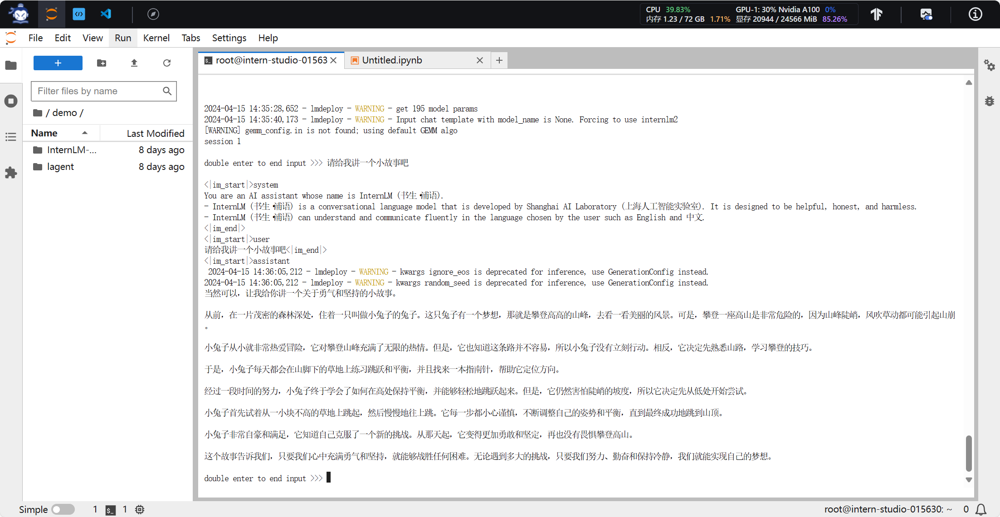

指令列表

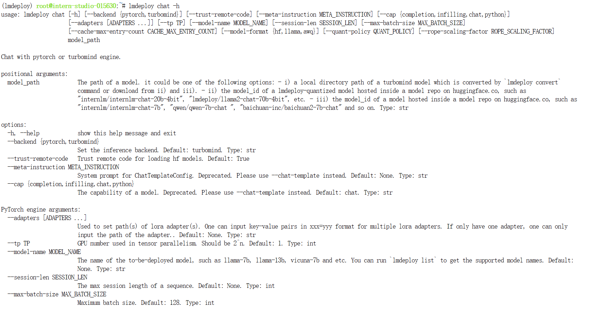


# 进阶作业

- ## 设置KV Cache最大占用比例为0.4，开启W4A16量化，以命令行方式与模型对话。（优秀学员必做）

本部分内容主要介绍如何对模型进行量化。主要包括 KV8量化和W4A16量化。总的来说，量化是一种以参数或计算中间结果精度下降换空间节省（以及同时带来的性能提升）的策略。

正式介绍 LMDeploy 量化方案前，需要先介绍两个概念：

计算密集（compute-bound）: 指推理过程中，绝大部分时间消耗在数值计算上；针对计算密集型场景，可以通过使用更快的硬件计算单元来提升计算速度。
访存密集（memory-bound）: 指推理过程中，绝大部分时间消耗在数据读取上；针对访存密集型场景，一般通过减少访存次数、提高计算访存比或降低访存量来优化。
常见的 LLM 模型由于 Decoder Only 架构的特性，实际推理时大多数的时间都消耗在了逐 Token 生成阶段（Decoding 阶段），是典型的访存密集型场景。

那么，如何优化 LLM 模型推理中的访存密集问题呢？ 我们可以使用KV8量化和W4A16量化。KV8量化是指将逐 Token（Decoding）生成过程中的上下文 K 和 V 中间结果进行 INT8 量化（计算时再反量化），以降低生成过程中的显存占用。W4A16 量化，将 FP16 的模型权重量化为 INT4，Kernel 计算时，访存量直接降为 FP16 模型的 1/4，大幅降低了访存成本。Weight Only 是指仅量化权重，数值计算依然采用 FP16（需要将 INT4 权重反量化）。


##  设置最大KV Cache缓存大小 ---- 仅模型使用时启动，不修改模型文件


KV Cache是一种缓存技术，通过存储键值对的形式来复用计算结果，以达到提高性能和降低内存消耗的目的。在大规模训练和推理中，KV Cache可以显著减少重复计算量，从而提升模型的推理速度。理想情况下，KV Cache全部存储于显存，以加快访存速度。当显存空间不足时，也可以将KV Cache放在内存，通过缓存管理器控制将当前需要使用的数据放入显存。

模型在运行时，占用的显存可大致分为三部分：模型参数本身占用的显存、KV Cache占用的显存，以及中间运算结果占用的显存。LMDeploy的KV Cache管理器可以通过设置`--cache-max-entry-count`参数，控制KV缓存**占用剩余显存**的最大比例。默认的比例为0.8。

下面通过几个例子，来看一下调整`--cache-max-entry-count`参数的效果。首先保持不加该参数（默认0.8），运行1.8B模型。

```
lmdeploy chat /root/internlm2-chat-1_8b
```


与模型对话，查看右上角资源监视器中的显存占用情况。

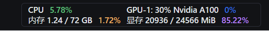

此时显存占用为7856MB。下面，改变`--cache-max-entry-count`参数，设为0.4。

```
lmdeploy chat /root/internlm2-chat-1_8b --cache-max-entry-count 0.4
```


与模型对话，再次查看右上角资源监视器中的显存占用情况。

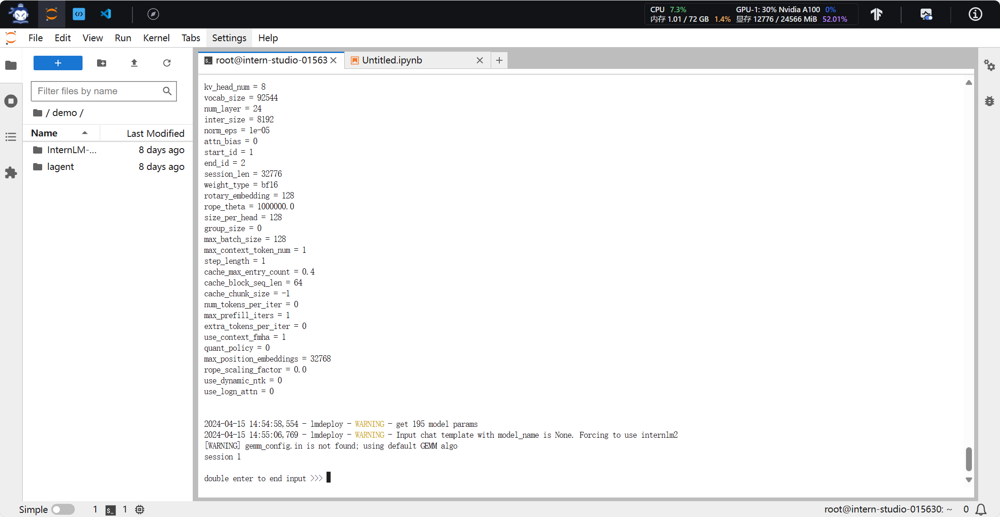

看到显存占用明显降低。


下面来一波“极限”，把`--cache-max-entry-count`参数设置为0.01，约等于禁止KV Cache占用显存。

```
lmdeploy chat /root/internlm2-chat-1_8b --cache-max-entry-count 0.01
```


## 使用W4A16量化 ---- 会修改模型文件，生成新的

LMDeploy使用AWQ算法，实现模型4bit权重量化。推理引擎TurboMind提供了非常高效的4bit推理cuda kernel，性能是FP16的2.4倍以上。它支持以下NVIDIA显卡：

- 图灵架构（sm75）：20系列、T4
- 安培架构（sm80,sm86）：30系列、A10、A16、A30、A100
- Ada Lovelace架构（sm90）：40 系列

运行前，首先安装一个依赖库。

```
pip install einops==0.7.0
```


仅需执行一条命令，就可以完成模型量化工作。

```
lmdeploy lite auto_awq \
   /root/internlm2-chat-1_8b \
  --calib-dataset 'ptb' \
  --calib-samples 128 \
  --calib-seqlen 1024 \
  --w-bits 4 \
  --w-group-size 128 \
  --work-dir /root/internlm2-chat-1_8b-4bit
```


运行时间较长，请耐心等待。量化工作结束后，新的HF模型被保存到`internlm2-chat-1_8b-4bit`目录。下面使用Chat功能运行W4A16量化后的模型。

```
lmdeploy chat /root/internlm2-chat-1_8b-4bit --model-format awq
```


为了更加明显体会到W4A16的作用，我们将KV Cache比例再次调为0.01，查看显存占用情况。

```
lmdeploy chat /root/internlm2-chat-1_8b-4bit --model-format awq --cache-max-entry-count 0.01
```


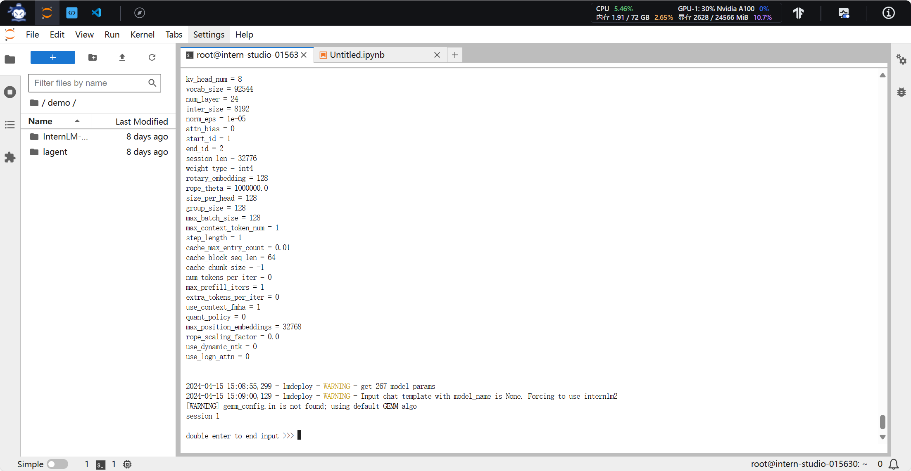


##  以API Server方式启动 lmdeploy，开启 W4A16量化，调整KV Cache的占用比例为0.4，分别使用命令行客户端与Gradio网页客户端与模型对话。


架构图：

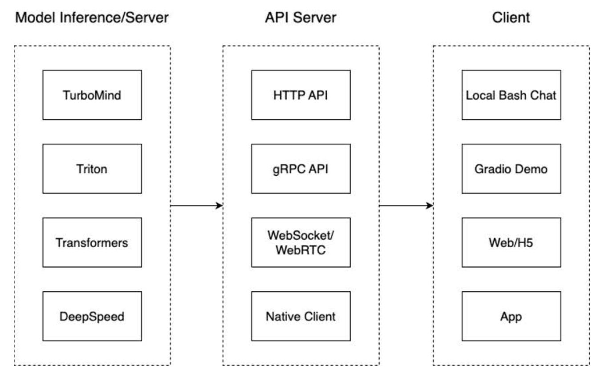

我们把从架构上把整个服务流程分成下面几个模块。

- 模型推理/服务。主要提供模型本身的推理，一般来说可以和具体业务解耦，专注模型推理本身性能的优化。可以以模块、API等多种方式提供。
- API Server。中间协议层，把后端推理/服务通过HTTP，gRPC或其他形式的接口，供前端调用。
- Client。可以理解为前端，与用户交互的地方。通过通过网页端/命令行去调用API接口，获取模型推理/服务。

值得说明的是，以上的划分是一个相对完整的模型，但在实际中这并不是绝对的。比如可以把“模型推理”和“API Server”合并，有的甚至是三个流程打包在一起提供服务。


## 4.1 启动API服务器

### 一、命令行客户端

通过以下命令启动API服务器，推理`internlm2-chat-1_8b`模型：

```
lmdeploy serve api_server \
    /root/internlm2-chat-1_8b \
    --model-format hf \
    --quant-policy 0 \
    --server-name 0.0.0.0 \
    --server-port 23333 \
    --tp 1
```


其中，model-format、quant-policy这些参数是与第三章中量化推理模型一致的；server-name和server-port表示API服务器的服务IP与服务端口；tp参数表示并行数量（GPU数量）。

通过运行以上指令，我们成功启动了API服务器，请勿关闭该窗口，后面我们要新建客户端连接该服务。

可以通过运行一下指令，查看更多参数及使用方法：

```
lmdeploy serve api_server -h
```


你也可以直接打开`http://{host}:23333`查看接口的具体使用说明，如下图所示。


```
与之前有区别，端口变了
ssh -CNg -L 7860:127.0.0.1:7860 root@ssh.intern-ai.org.cn -p 43484
ssh -CNg -L 23333:127.0.0.1:23333 root@ssh.intern-ai.org.cn -p 43484
bPrPgxMvGdD2lfZH

打开链接
http://127.0.0.1:23333
```


### 开启KV Cache与W4A16：

修改启动命令

```
lmdeploy serve api_server \
    /root/internlm2-chat-1_8b-4bit \
    --model-format hf \
    --quant-policy 0 \
    --server-name 0.0.0.0 \
    --server-port 23333 \
    --tp 1 \
    --model-format awq \
    --cache-max-entry-count 0.4 
```


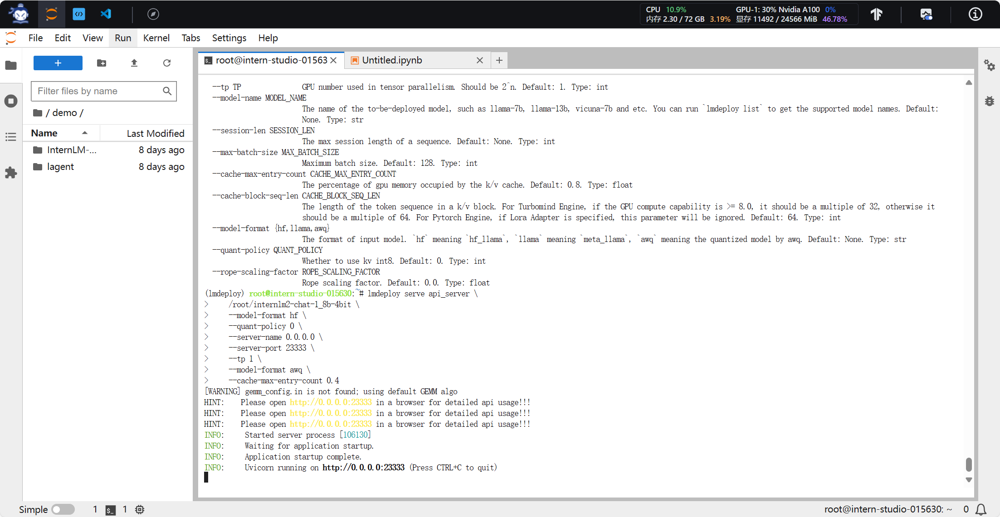

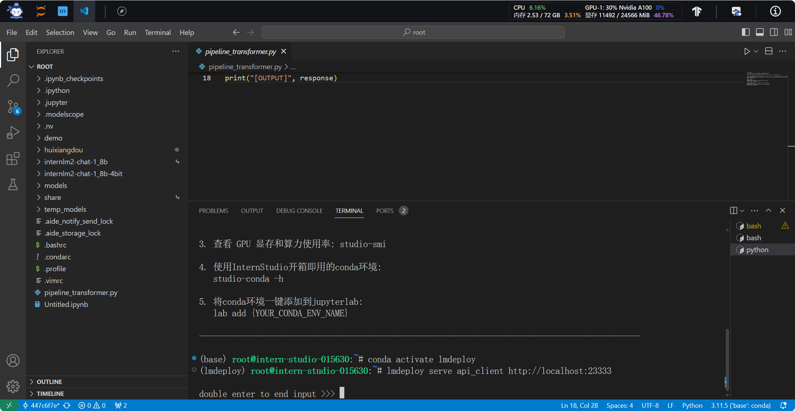


### 二、Gradio 调用


```
lmdeploy serve gradio http://localhost:23333 \
    --server-name 0.0.0.0 \
    --server-port 6006
```

```
ssh -CNg -L 6006:127.0.0.1:6006 root@ssh.intern-ai.org.cn -p 43484
bPrPgxMvGdD2lfZH
```

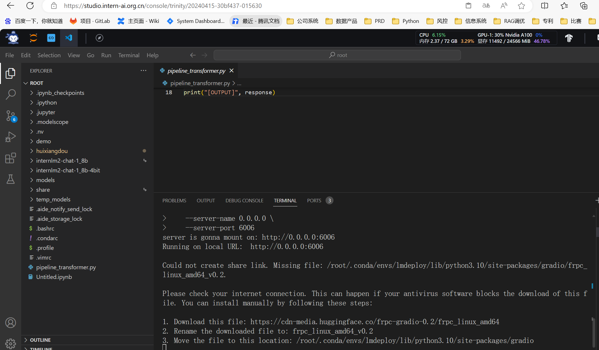

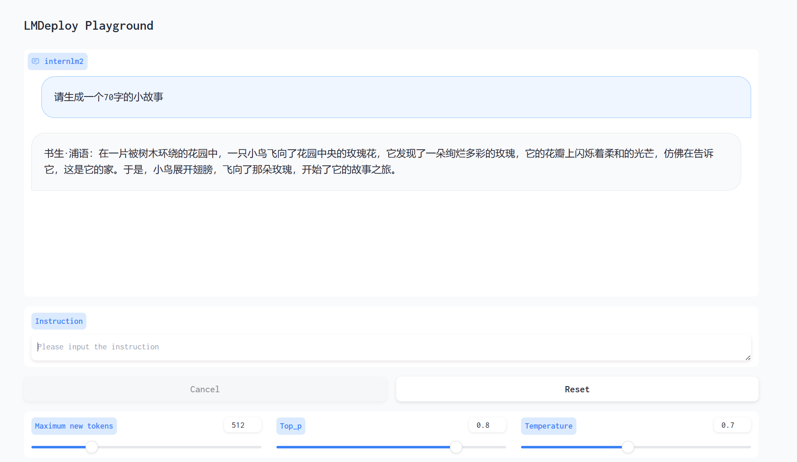


## 使用W4A16量化，调整KV Cache的占用比例为0.4，使用Python代码集成的方式运行internlm2-chat-1.8b模型。

打开`pipeline.py`，填入以下内容。

```
from lmdeploy import pipeline

pipe = pipeline('/root/internlm2-chat-1_8b')
response = pipe(['Hi, pls intro yourself', '上海是'])
print(response)
```


> **代码解读**：\
>
> - 第1行，引入lmdeploy的pipeline模块 \
> - 第3行，从目录“./internlm2-chat-1_8b”加载HF模型 \
> - 第4行，运行pipeline，这里采用了批处理的方式，用一个列表包含两个输入，lmdeploy同时推理两个输入，产生两个输出结果，结果返回给response \
> - 第5行，输出response

保存后运行代码文件：

```
python /root/pipeline.py
```


##  向TurboMind后端传递参数


在第3章，我们通过向lmdeploy传递附加参数，实现模型的量化推理，及设置KV Cache最大占用比例。在Python代码中，可以通过创建TurbomindEngineConfig，向lmdeploy传递参数。

以设置KV Cache占用比例为例，新建python文件`pipeline_kv.py`。

```
touch /root/pipeline_kv.py
```


打开`pipeline_kv.py`，填入如下内容：

```
from lmdeploy import pipeline, TurbomindEngineConfig

# 调低 k/v cache内存占比调整为总显存的 20%
backend_config = TurbomindEngineConfig(cache_max_entry_count=0.4)

pipe = pipeline('/root/internlm2-chat-1_8b-4bit',
                backend_config=backend_config)
response = pipe(['Hi, pls intro yourself', '上海是'])
print(response)
```


保存后运行python代码：

```
python /root/pipeline_kv.py
```


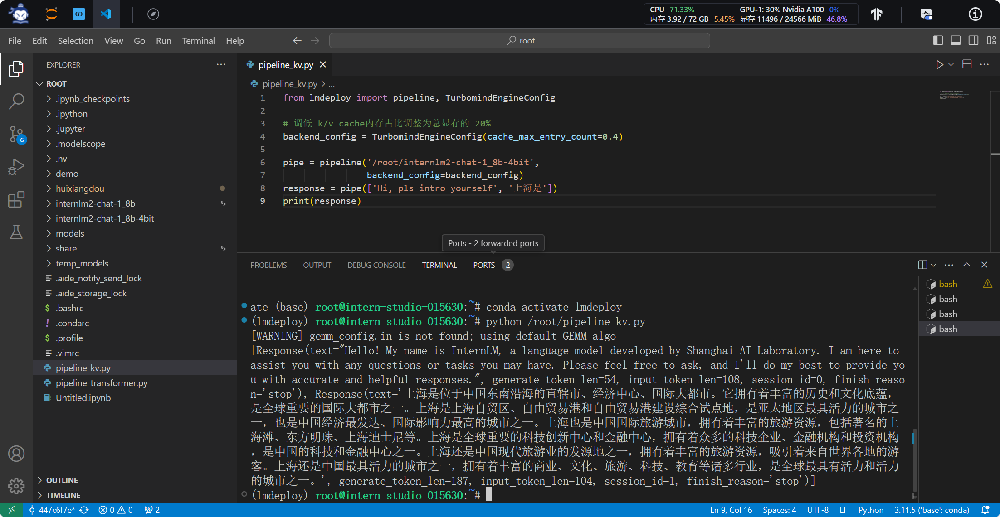


## 使用 LMDeploy 运行视觉多模态大模型 llava gradio demo


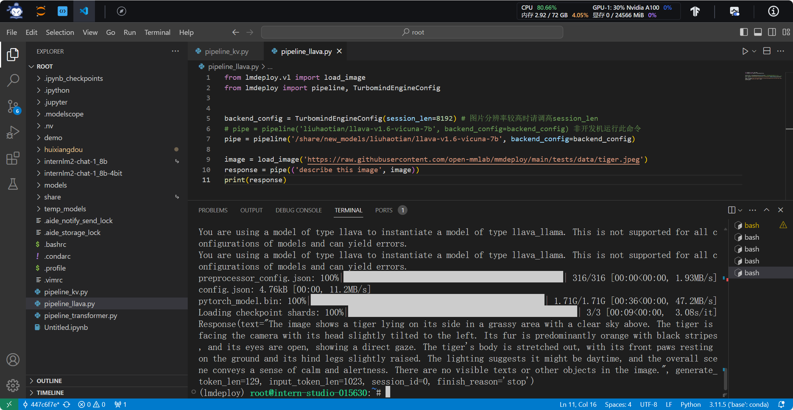


