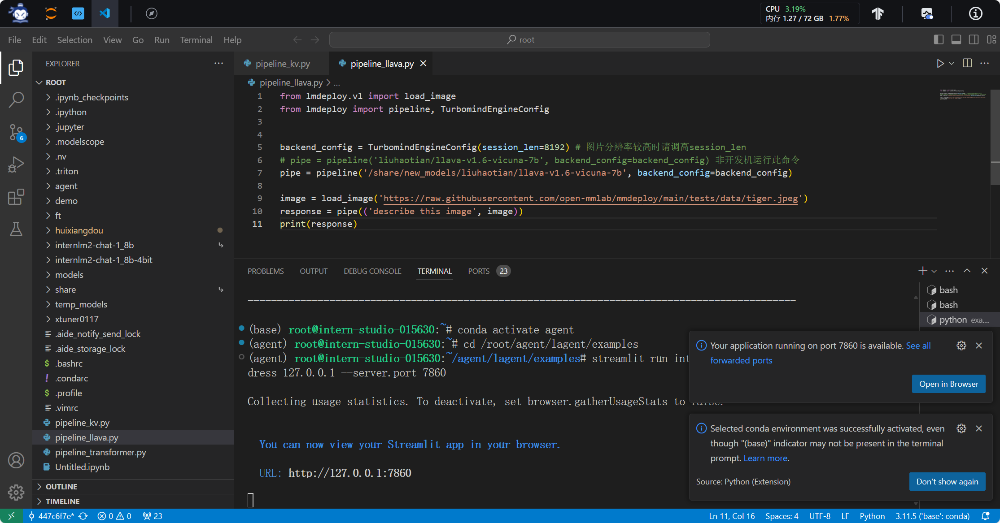
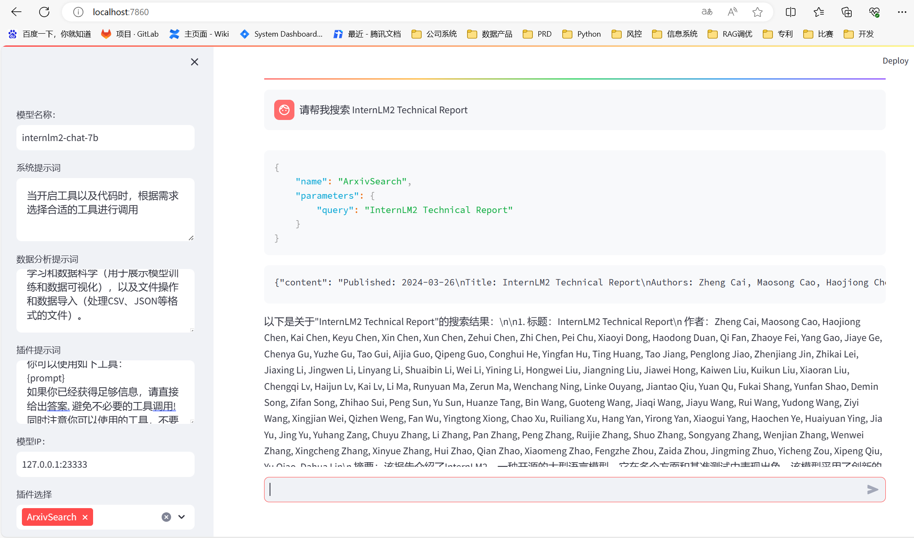
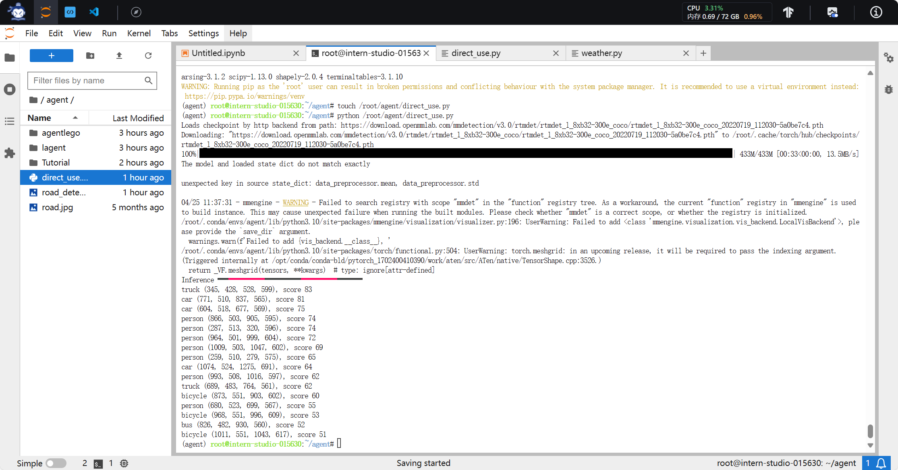
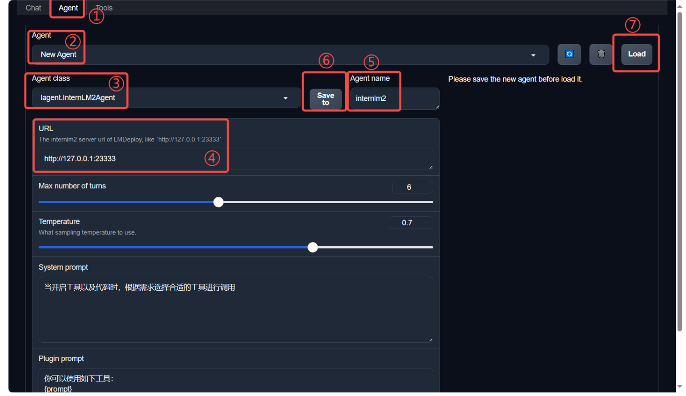
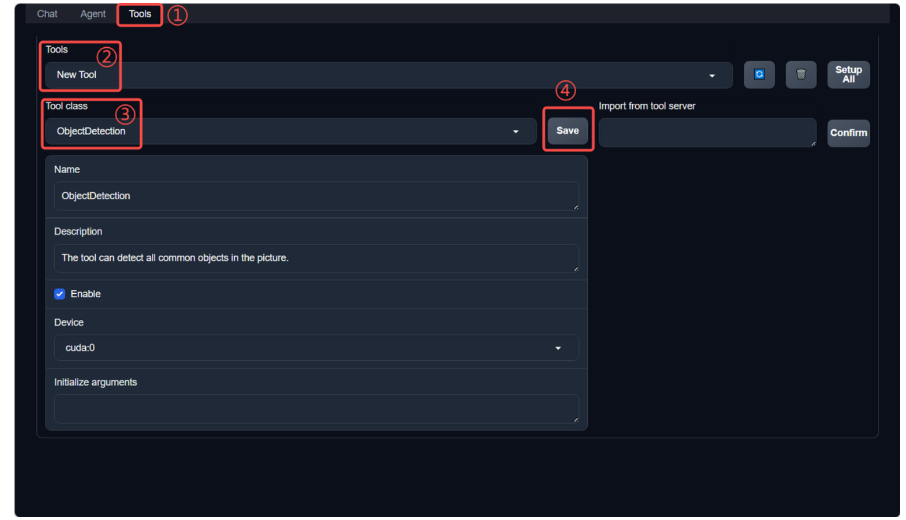
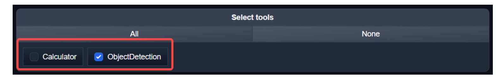
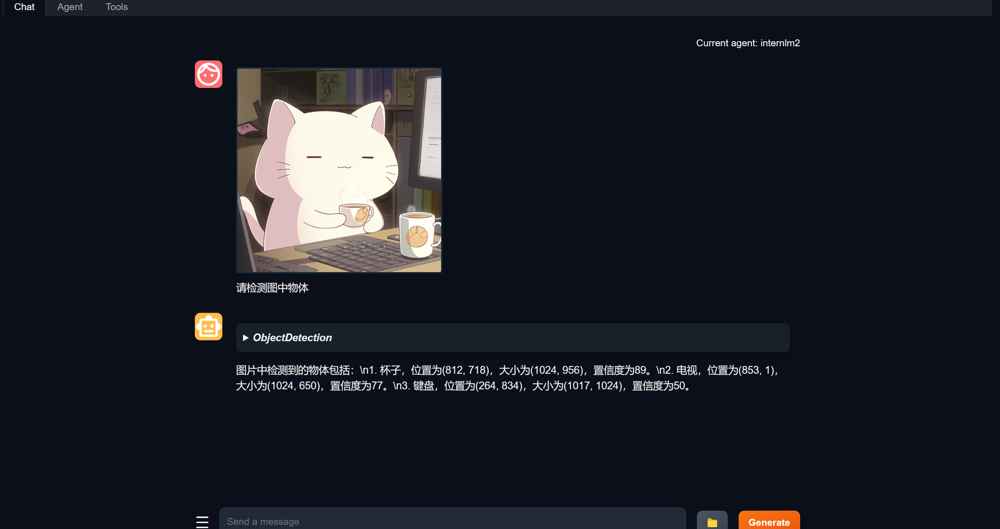
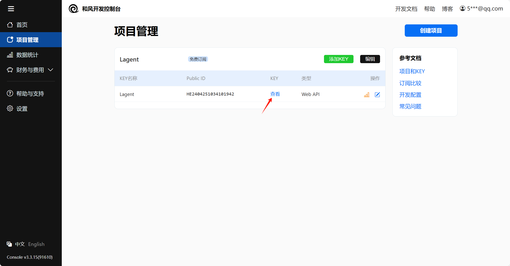
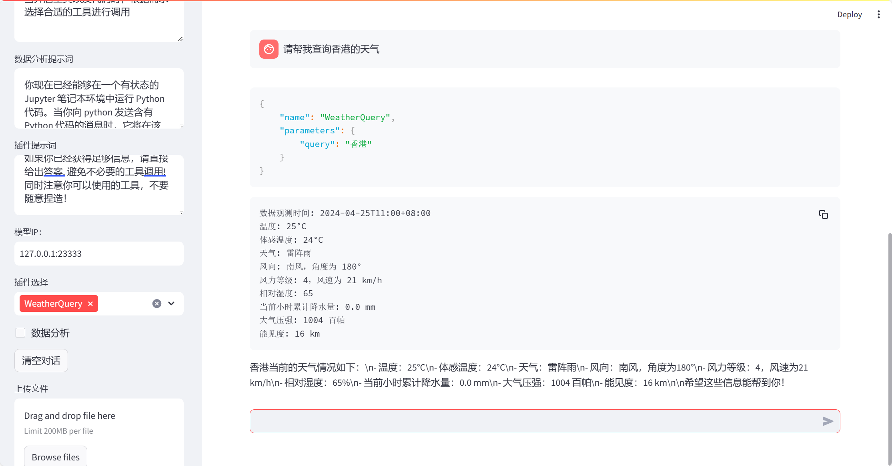

[Tutorial/agent/homework.md at camp2 · InternLM/Tutorial (github.com)](https://github.com/InternLM/Tutorial/blob/camp2/agent/homework.md)

[Tutorial/agent at camp2 · InternLM/Tutorial (github.com)](https://github.com/InternLM/Tutorial/tree/camp2/agent)


# 作业


Tip

结营必做基础作业；优秀学员或进入对应 SIG 需完成进阶作业。

## 基础作业

```
mkdir -p /root/agent
```


接下来，我们开始配置 conda 环境，可以输入如下指令：

```
studio-conda -t agent -o pytorch-2.1.2
```


<details style="box-sizing: border-box; display: block; margin-top: 0px; margin-bottom: 16px; color: rgb(31, 35, 40); font-family: -apple-system, BlinkMacSystemFont, &quot;Segoe UI&quot;, &quot;Noto Sans&quot;, Helvetica, Arial, sans-serif, &quot;Apple Color Emoji&quot;, &quot;Segoe UI Emoji&quot;; font-size: 16px; font-style: normal; font-variant-ligatures: normal; font-variant-caps: normal; font-weight: 400; letter-spacing: normal; orphans: 2; text-align: start; text-indent: 0px; text-transform: none; widows: 2; word-spacing: 0px; -webkit-text-stroke-width: 0px; white-space: normal; background-color: rgb(255, 255, 255); text-decoration-thickness: initial; text-decoration-style: initial; text-decoration-color: initial;"><summary style="box-sizing: border-box; display: list-item; cursor: pointer;"><b style="box-sizing: border-box; font-weight: var(--base-text-weight-semibold, 600);">非 InterStudio 开发机</b>环境配置</summary><slot id="details-content" style="content-visibility: hidden; display: block;"></slot></details>

#### 1.4.2 安装 Lagent 和 AgentLego


Lagent 和 AgentLego 都提供了两种安装方法，一种是通过 pip 直接进行安装，另一种则是从源码进行安装。为了方便使用 Lagent 的 Web Demo 以及 AgentLego 的 WebUI，我们选择直接从源码进行安装。 此处附上源码安装的相关帮助文档：

- Lagent：https://lagent.readthedocs.io/zh-cn/latest/get_started/install.html
- AgentLego：https://agentlego.readthedocs.io/zh-cn/latest/get_started.html

可以执行如下命令进行安装：

```
cd /root/agent
conda activate agent
git clone https://gitee.com/internlm/lagent.git
cd lagent && git checkout 581d9fb && pip install -e . && cd ..
git clone https://gitee.com/internlm/agentlego.git
cd agentlego && git checkout 7769e0d && pip install -e . && cd ..
```


#### 1.4.3 安装其他依赖


在这一步中，我们将会安装其他将要用到的依赖库，如 LMDeploy，可以执行如下命令：

```
conda activate agent
pip install lmdeploy==0.3.0
```


#### 1.4.4 准备 Tutorial


由于后续的 Demo 需要用到 tutorial 已经写好的脚本，因此我们需要将 tutorial 通过 git clone 的方法准备好，以备后续使用：

```
cd /root/agent
git clone -b camp2 https://gitee.com/internlm/Tutorial.git
```


1. **完成 Lagent Web Demo 使用，并在作业中上传截图。文档可见 [Lagent Web Demo](https://github.com/InternLM/Tutorial/blob/camp2/agent/lagent.md#1-lagent-web-demo)**


## 1. Lagent Web Demo


### 1.1 使用 LMDeploy 部署

由于 Lagent 的 Web Demo 需要用到 LMDeploy 所启动的 api_server，因此我们首先按照下图指示在 vscode terminal 中执行如下代码使用 LMDeploy 启动一个 api_server。

```
conda activate agent

lmdeploy serve api_server /root/share/new_models/Shanghai_AI_Laboratory/internlm2-chat-7b --server-name 127.0.0.1 --model-name internlm2-chat-7b --cache-max-entry-count 0.1
```


```
conda activate agent
cd /root/agent/lagent/examples
streamlit run internlm2_agent_web_demo.py --server.address 127.0.0.1 --server.port 7860
```




在等待 LMDeploy 的 api_server 与 Lagent Web Demo 完全启动后（如下图所示），在**本地**进行端口映射，将 LMDeploy api_server 的23333端口以及 Lagent Web Demo 的7860端口映射到本地。可以执行：

```
ssh -CNg -L 7860:127.0.0.1:7860 -L 23333:127.0.0.1:23333 root@ssh.intern-ai.org.cn -p  43484

bPrPgxMvGdD2lfZH
```


接下来在本地的浏览器页面中打开 [http://localhost:7860](http://localhost:7860/) 以使用 Lagent Web Demo。首先输入模型 IP 为 127.0.0.1:23333，**在输入完成后按下回车键以确认**。并选择插件为 ArxivSearch，以让模型获得在 arxiv 上搜索论文的能力。




1. **完成 AgentLego 直接使用部分，并在作业中上传截图。文档可见 [直接使用 AgentLego](https://github.com/InternLM/Tutorial/blob/camp2/agent/agentlego.md#1-直接使用-agentlego)。**

# AgentLego：组装智能体“乐高”

在介绍中我们提到过，AgentLego 算法库既可以直接使用，也可以作为智能体工具使用。下面将分别介绍这两种使用方式。我们将以目标检测工具为例。

## 1. 直接使用 AgentLego


首先下载 demo 文件：

```
cd /root/agent
wget http://download.openmmlab.com/agentlego/road.jpg
```


由于 AgentLego 在安装时并不会安装某个特定工具的依赖，因此我们接下来准备安装目标检测工具运行时所需依赖。

AgentLego 所实现的目标检测工具是基于 mmdet (MMDetection) 算法库中的 RTMDet-Large 模型，因此我们首先安装 mim，然后通过 mim 工具来安装 mmdet。这一步所需时间可能会较长，请耐心等待。

```
conda activate agent
pip install openmim==0.3.9
mim install mmdet==3.3.0
```





## 进阶作业


1. 完成 AgentLego WebUI 使用，并在作业中上传截图。文档可见 [AgentLego WebUI](https://github.com/InternLM/Tutorial/blob/camp2/agent/agentlego.md#2-作为智能体工具使用)。
2. 使用 Lagent 或 AgentLego 实现自定义工具并完成调用，并在作业中上传截图。文档可见：
   - [用 Lagent 自定义工具](https://github.com/InternLM/Tutorial/blob/camp2/agent/lagent.md#2-用-lagent-自定义工具)
   - [用 AgentLego 自定义工具](https://github.com/InternLM/Tutorial/blob/camp2/agent/agentlego.md#3-用-agentlego-自定义工具)


## 2 作为智能体工具使用


### 2.1 修改相关文件


由于 AgentLego 算法库默认使用 InternLM2-Chat-20B 模型，因此我们首先需要修改 /root/agent/agentlego/webui/modules/agents/lagent_agent.py 文件的第 105行位置，将 internlm2-chat-20b 修改为 internlm2-chat-7b，即

```
def llm_internlm2_lmdeploy(cfg):
    url = cfg['url'].strip()
    llm = LMDeployClient(
-         model_name='internlm2-chat-20b',
+         model_name='internlm2-chat-7b',
        url=url,
        meta_template=INTERNLM2_META,
        top_p=0.8,
        top_k=100,
        temperature=cfg.get('temperature', 0.7),
        repetition_penalty=1.0,
        stop_words=['<|im_end|>'])
    return llm
```


其中红色表示要删除的内容，绿色表示要添加的内容。

### 2.2 使用 LMDeploy 部署


由于 AgentLego 的 WebUI 需要用到 LMDeploy 所启动的 api_server，因此我们首先按照下图指示在 vscode terminal 中执行如下代码使用 LMDeploy 启动一个 api_server。

```
conda activate agent
lmdeploy serve api_server /root/share/new_models/Shanghai_AI_Laboratory/internlm2-chat-7b \
                            --server-name 127.0.0.1 \
                            --model-name internlm2-chat-7b \
                            --cache-max-entry-count 0.1
```


### 2.3 启动 AgentLego WebUI


接下来我们按照下图指示新建一个 terminal 以启动 AgentLego WebUI。在新建的 terminal 中执行如下指令：

```
conda activate agent
cd /root/agent/agentlego/webui
python one_click.py
```


在等待 LMDeploy 的 api_server 与 AgentLego WebUI 完全启动后（如下图所示），在**本地**进行端口映射，将 LMDeploy api_server 的23333端口以及 AgentLego WebUI 的7860端口映射到本地。可以执行：

```
ssh -CNg -L 7860:127.0.0.1:7860 -L 23333:127.0.0.1:23333 root@ssh.intern-ai.org.cn -p  43484

bPrPgxMvGdD2lfZH
```


| LMDeploy api_server | AgentLego WebUI |
| ------------------- | --------------- |
|                     |                 |


### 2.4 使用 AgentLego WebUI


接下来在本地的浏览器页面中打开 [http://localhost:7860](http://localhost:7860/) 以使用 AgentLego WebUI。首先来配置 Agent，如下图所示。

1. 点击上方 Agent 进入 Agent 配置页面。（如①所示）
2. 点击 Agent 下方框，选择 New Agent。（如②所示）
3. 选择 Agent Class 为 lagent.InternLM2Agent。（如③所示）
4. 输入模型 URL 为 [http://127.0.0.1:23333](http://127.0.0.1:23333/) 。（如④所示）
5. 输入 Agent name，自定义即可，图中输入了 internlm2。（如⑤所示）
6. 点击 save to 以保存配置，这样在下次使用时只需在第2步时选择 Agent 为 internlm2 后点击 load 以加载就可以了。（如⑥所示）
7. 点击 load 以加载配置。（如⑦所示）




然后配置工具，如下图所示。

1. 点击上方 Tools 页面进入工具配置页面。（如①所示）
2. 点击 Tools 下方框，选择 New Tool 以加载新工具。（如②所示）
3. 选择 Tool Class 为 ObjectDetection。（如③所示）
4. 点击 save 以保存配置。（如④所示）



等待工具加载完成后，点击上方 Chat 以进入对话页面。在页面下方选择工具部分只选择 ObjectDetection 工具，如下图所示。为了确保调用工具的成功率，请在使用时确保仅有这一个工具启用。



接下来就可以愉快地使用 Agent 了。点击右下角文件夹以上传图片，上传图片后输入指令并点击 generate 以得到模型回复。如下图所示，我们上传了 demo 图片，模型成功地调用了工具，并详细地告诉了我们图中的内容。



### 2.4 使用 AgentLego WebUI


## . 用 Lagent 自定义工具


在本节中，我们将基于 Lagent 自定义一个工具。Lagent 中关于工具部分的介绍文档位于 https://lagent.readthedocs.io/zh-cn/latest/tutorials/action.html 。使用 Lagent 自定义工具主要分为以下几步：

1. 继承 BaseAction 类
2. 实现简单工具的 run 方法；或者实现工具包内每个子工具的功能
3. 简单工具的 run 方法可选被 tool_api 装饰；工具包内每个子工具的功能都需要被 tool_api 装饰

下面我们将实现一个调用和风天气 API 的工具以完成实时天气查询的功能。

### 2.1 创建工具文件


首先通过 `touch /root/agent/lagent/lagent/actions/weather.py`（大小写敏感）新建工具文件，该文件内容如下：

```
import json
import os
import requests
from typing import Optional, Type

from lagent.actions.base_action import BaseAction, tool_api
from lagent.actions.parser import BaseParser, JsonParser
from lagent.schema import ActionReturn, ActionStatusCode

class WeatherQuery(BaseAction):
    """Weather plugin for querying weather information."""
    
    def __init__(self,
                 key: Optional[str] = None,
                 description: Optional[dict] = None,
                 parser: Type[BaseParser] = JsonParser,
                 enable: bool = True) -> None:
        super().__init__(description, parser, enable)
        key = os.environ.get('WEATHER_API_KEY', key)
        if key is None:
            raise ValueError(
                'Please set Weather API key either in the environment '
                'as WEATHER_API_KEY or pass it as `key`')
        self.key = key
        self.location_query_url = 'https://geoapi.qweather.com/v2/city/lookup'
        self.weather_query_url = 'https://devapi.qweather.com/v7/weather/now'

    @tool_api
    def run(self, query: str) -> ActionReturn:
        """一个天气查询API。可以根据城市名查询天气信息。
        
        Args:
            query (:class:`str`): The city name to query.
        """
        tool_return = ActionReturn(type=self.name)
        status_code, response = self._search(query)
        if status_code == -1:
            tool_return.errmsg = response
            tool_return.state = ActionStatusCode.HTTP_ERROR
        elif status_code == 200:
            parsed_res = self._parse_results(response)
            tool_return.result = [dict(type='text', content=str(parsed_res))]
            tool_return.state = ActionStatusCode.SUCCESS
        else:
            tool_return.errmsg = str(status_code)
            tool_return.state = ActionStatusCode.API_ERROR
        return tool_return
    
    def _parse_results(self, results: dict) -> str:
        """Parse the weather results from QWeather API.
        
        Args:
            results (dict): The weather content from QWeather API
                in json format.
        
        Returns:
            str: The parsed weather results.
        """
        now = results['now']
        data = [
            f'数据观测时间: {now["obsTime"]}',
            f'温度: {now["temp"]}°C',
            f'体感温度: {now["feelsLike"]}°C',
            f'天气: {now["text"]}',
            f'风向: {now["windDir"]}，角度为 {now["wind360"]}°',
            f'风力等级: {now["windScale"]}，风速为 {now["windSpeed"]} km/h',
            f'相对湿度: {now["humidity"]}',
            f'当前小时累计降水量: {now["precip"]} mm',
            f'大气压强: {now["pressure"]} 百帕',
            f'能见度: {now["vis"]} km',
        ]
        return '\n'.join(data)

    def _search(self, query: str):
        # get city_code
        try:
            city_code_response = requests.get(
                self.location_query_url,
                params={'key': self.key, 'location': query}
            )
        except Exception as e:
            return -1, str(e)
        if city_code_response.status_code != 200:
            return city_code_response.status_code, city_code_response.json()
        city_code_response = city_code_response.json()
        if len(city_code_response['location']) == 0:
            return -1, '未查询到城市'
        city_code = city_code_response['location'][0]['id']
        # get weather
        try:
            weather_response = requests.get(
                self.weather_query_url,
                params={'key': self.key, 'location': city_code}
            )
        except Exception as e:
            return -1, str(e)
        return weather_response.status_code, weather_response.json()
```


### 2.2 获取 API KEY


为了获得稳定的天气查询服务，我们首先要获取 API KEY。首先打开 https://dev.qweather.com/docs/api/ 后，点击右上角控制台。（如下图所示）

[](https://github.com/InternLM/Tutorial/blob/camp2/agent/assets/lagent/qweather.png)

进入控制台后，点击左侧项目管理，然后点击右上角创建项目以创建新项目。（如下图所示）

[](https://github.com/InternLM/Tutorial/blob/camp2/agent/assets/lagent/create_project.png)

输入相关项目名称，选择免费订阅，**Web API** 以及输入 key 的名称。（项目名称和 key 的名词自由输入即可，如下图所示）

[](https://github.com/InternLM/Tutorial/blob/camp2/agent/assets/lagent/create_project2.png)

接下来回到项目管理页面，查看我们刚刚创建的 key，并且复制好以供2.3节中使用。（如下图所示）




### 体验自定义工具效果


与 1.2 部分类似，我们在两个 terminal 中分别启动 LMDeploy 服务和 Tutorial 已经写好的用于这部分的 Web Demo：

Important

注意，确保 1.1 节中的 LMDeploy 服务以及 1.2 节中的 Web Demo 服务已经停止（即 terminal 已关闭），否则会出现 CUDA Out of Memory 或是端口已占用的情况！

```
conda activate agent
lmdeploy serve api_server /root/share/new_models/Shanghai_AI_Laboratory/internlm2-chat-7b --server-name 127.0.0.1 --model-name internlm2-chat-7b --cache-max-entry-count 0.1
```


```
export WEATHER_API_KEY=a1961eac362f446197febed95ea7e627
# 比如 export WEATHER_API_KEY=1234567890abcdef
conda activate agent
cd /root/agent/Tutorial/agent
streamlit run internlm2_weather_web_demo.py --server.address 127.0.0.1 --server.port 7860
```


并在**本地**执行如下操作以进行端口映射：

```
ssh -CNg -L 7860:127.0.0.1:7860 -L 23333:127.0.0.1:23333 root@ssh.intern-ai.org.cn -p  43484

bPrPgxMvGdD2lfZH
```


在输入模型地址并选择好工具后，就可以开始体验了。下图是一个例子：


接下来在本地的浏览器页面中打开 [http://localhost:7860](http://localhost:7860/) 以使用 Lagent Web Demo。首先输入模型 IP 为 127.0.0.1:23333，**在输入完成后按下回车键以确认**。并选择插件为 ArxivSearch，以让模型获得在 arxiv 上搜索论文的能力。





**备份：**

**数据分析提示词：**你现在已经能够在一个有状态的 Jupyter 笔记本环境中运行 Python 代码。当你向 python 发送含有 Python 代码的消息时，它将在该环境中执行。这个工具适用于多种场景，如数据分析或处理（包括数据操作、统计分析、图表绘制），复杂的计算问题（解决数学和物理难题），编程示例（理解编程概念或特性），文本处理和分析（比如文本解析和自然语言处理），机器学习和数据科学（用于展示模型训练和数据可视化），以及文件操作和数据导入（处理CSV、JSON等格式的文件）。


**插件提示词：**你可以使用如下工具：
{prompt}
如果你已经获得足够信息，请直接给出答案. 避免不必要的工具调用! 同时注意你可以使用的工具，不要随意捏造！


## 大作业选题


### 算法方向


1. 在 Lagent 或 AgentLego 中实现 RAG 工具，实现智能体与知识库的交互。
2. 基于 Lagent 或 AgentLego 实现工具的多轮调用，完成复杂任务。如：智能体调用翻译工具，再调用搜索工具，最后调用生成工具，完成一个完整的任务。
3. ...

### 应用方向


1. 基于 Lagent 或 AgentLego 实现一个客服智能体，帮助用户解决问题。
2. 基于 Lagent 或 AgentLego 实现一个智能体，实现艺术创作，如生成图片、视频、音乐等。