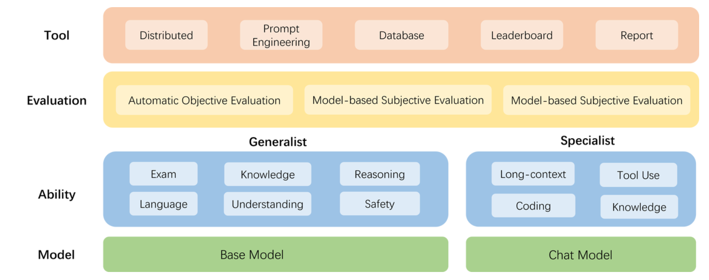
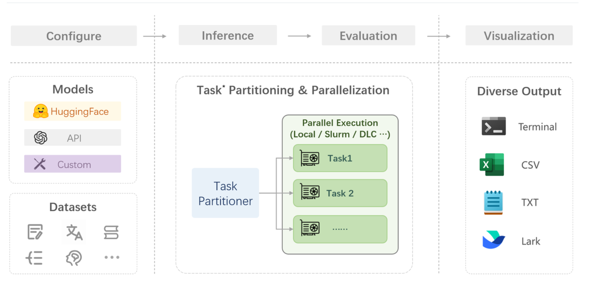
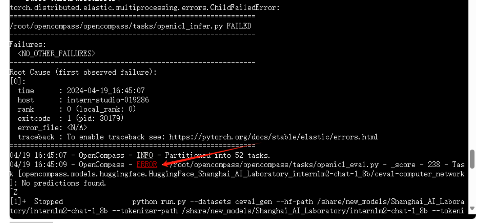
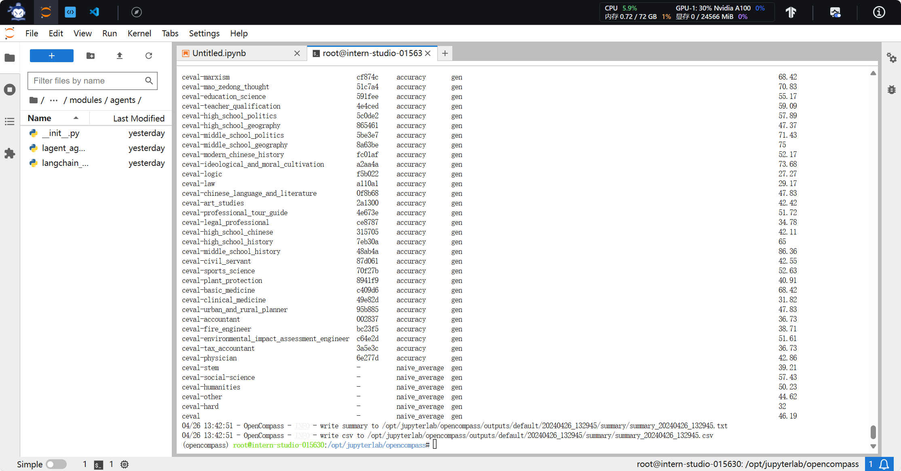

[Tutorial/agent/homework.md at camp2 · InternLM/Tutorial (github.com)](https://github.com/InternLM/Tutorial/blob/camp2/agent/homework.md)

[Tutorial/agent at camp2 · InternLM/Tutorial (github.com)](https://github.com/InternLM/Tutorial/tree/camp2/agent)


## 1. 作业(第7节课)


### 基础作业


- 使用 OpenCompass 评测 internlm2-chat-1_8b 模型在 C-Eval 数据集上的性能


## 为什么要研究大模型的评测？


百家争鸣，百花齐放。

1. 首先，研究评测对于我们全面了解大型语言模型的优势和限制至关重要。尽管许多研究表明大型语言模型在多个通用任务上已经达到或超越了人类水平，但仍然存在质疑，即这些模型的能力是否只是对训练数据的记忆而非真正的理解。例如，即使只提供LeetCode题目编号而不提供具体信息，大型语言模型也能够正确输出答案，这暗示着训练数据可能存在污染现象。
2. 其次，研究评测有助于指导和改进人类与大型语言模型之间的协同交互。考虑到大型语言模型的最终服务对象是人类，为了更好地设计人机交互的新范式，我们有必要全面评估模型的各项能力。
3. 最后，研究评测可以帮助我们更好地规划大型语言模型未来的发展，并预防未知和潜在的风险。随着大型语言模型的不断演进，其能力也在不断增强。通过合理科学的评测机制，我们能够从进化的角度评估模型的能力，并提前预测潜在的风险，这是至关重要的研究内容。
4. 对于大多数人来说，大型语言模型可能似乎与他们无关，因为训练这样的模型成本较高。然而，就像飞机的制造一样，尽管成本高昂，但一旦制造完成，大家使用的机会就会非常频繁。因此，了解不同语言模型之间的性能、舒适性和安全性，能够帮助人们更好地选择适合的模型，这对于研究人员和产品开发者而言同样具有重要意义。

## OpenCompass介绍


上海人工智能实验室科学家团队正式发布了大模型开源开放评测体系 “司南” (OpenCompass2.0)，用于为大语言模型、多模态模型等提供一站式评测服务。其主要特点如下：

- 开源可复现：提供公平、公开、可复现的大模型评测方案
- 全面的能力维度：五大维度设计，提供 70+ 个数据集约 40 万题的的模型评测方案，全面评估模型能力
- 丰富的模型支持：已支持 20+ HuggingFace 及 API 模型
- 分布式高效评测：一行命令实现任务分割和分布式评测，数小时即可完成千亿模型全量评测
- 多样化评测范式：支持零样本、小样本及思维链评测，结合标准型或对话型提示词模板，轻松激发各种模型最大性能
- 灵活化拓展：想增加新模型或数据集？想要自定义更高级的任务分割策略，甚至接入新的集群管理系统？OpenCompass 的一切均可轻松扩展！

## 评测对象


本算法库的主要评测对象为语言大模型与多模态大模型。我们以语言大模型为例介绍评测的具体模型类型。

- 基座模型：一般是经过海量的文本数据以自监督学习的方式进行训练获得的模型（如OpenAI的GPT-3，Meta的LLaMA），往往具有强大的文字续写能力。
- 对话模型：一般是在的基座模型的基础上，经过指令微调或人类偏好对齐获得的模型（如OpenAI的ChatGPT、上海人工智能实验室的书生·浦语），能理解人类指令，具有较强的对话能力。

## 工具架构




- 模型层：大模型评测所涉及的主要模型种类，OpenCompass 以基座模型和对话模型作为重点评测对象。
- 能力层：OpenCompass 从本方案从通用能力和特色能力两个方面来进行评测维度设计。在模型通用能力方面，从语言、知识、理解、推理、安全等多个能力维度进行评测。在特色能力方面，从长文本、代码、工具、知识增强等维度进行评测。
- 方法层：OpenCompass 采用客观评测与主观评测两种评测方式。客观评测能便捷地评估模型在具有确定答案（如选择，填空，封闭式问答等）的任务上的能力，主观评测能评估用户对模型回复的真实满意度，OpenCompass 采用基于模型辅助的主观评测和基于人类反馈的主观评测两种方式。
- 工具层：OpenCompass 提供丰富的功能支持自动化地开展大语言模型的高效评测。包括分布式评测技术，提示词工程，对接评测数据库，评测榜单发布，评测报告生成等诸多功能。

## 设计思路


为准确、全面、系统化地评估大语言模型的能力，OpenCompass 从通用人工智能的角度出发，结合学术界的前沿进展和工业界的最佳实践，提出一套面向实际应用的模型能力评价体系。OpenCompass 能力维度体系涵盖通用能力和特色能力两大部分。

## 评测方法


OpenCompass 采取客观评测与主观评测相结合的方法。针对具有确定性答案的能力维度和场景，通过构造丰富完善的评测集，对模型能力进行综合评价。针对体现模型能力的开放式或半开放式的问题、模型安全问题等，采用主客观相结合的评测方式。

### 客观评测


针对具有标准答案的客观问题，我们可以我们可以通过使用定量指标比较模型的输出与标准答案的差异，并根据结果衡量模型的性能。同时，由于大语言模型输出自由度较高，在评测阶段，我们需要对其输入和输出作一定的规范和设计，尽可能减少噪声输出在评测阶段的影响，才能对模型的能力有更加完整和客观的评价。 为了更好地激发出模型在题目测试领域的能力，并引导模型按照一定的模板输出答案，OpenCompass 采用提示词工程 （prompt engineering）和语境学习（in-context learning）进行客观评测。 在客观评测的具体实践中，我们通常采用下列两种方式进行模型输出结果的评测：

- 判别式评测：该评测方式基于将问题与候选答案组合在一起，计算模型在所有组合上的困惑度（perplexity），并选择困惑度最小的答案作为模型的最终输出。例如，若模型在 问题? 答案1 上的困惑度为 0.1，在 问题? 答案2 上的困惑度为 0.2，最终我们会选择 答案1 作为模型的输出。
- 生成式评测：该评测方式主要用于生成类任务，如语言翻译、程序生成、逻辑分析题等。具体实践时，使用问题作为模型的原始输入，并留白答案区域待模型进行后续补全。我们通常还需要对其输出进行后处理，以保证输出满足数据集的要求。

### 主观评测


语言表达生动精彩，变化丰富，大量的场景和能力无法凭借客观指标进行评测。针对如模型安全和模型语言能力的评测，以人的主观感受为主的评测更能体现模型的真实能力，并更符合大模型的实际使用场景。 OpenCompass 采取的主观评测方案是指借助受试者的主观判断对具有对话能力的大语言模型进行能力评测。在具体实践中，我们提前基于模型的能力维度构建主观测试问题集合，并将不同模型对于同一问题的不同回复展现给受试者，收集受试者基于主观感受的评分。由于主观测试成本高昂，本方案同时也采用使用性能优异的大语言模拟人类进行主观打分。在实际评测中，本文将采用真实人类专家的主观评测与基于模型打分的主观评测相结合的方式开展模型能力评估。 在具体开展主观评测时，OpenComapss 采用单模型回复满意度统计和多模型满意度比较两种方式开展具体的评测工作。

## 快速开始



### 概览


在 OpenCompass 中评估一个模型通常包括以下几个阶段：配置 -> 推理 -> 评估 -> 可视化。

- 配置：这是整个工作流的起点。您需要配置整个评估过程，选择要评估的模型和数据集。此外，还可以选择评估策略、计算后端等，并定义显示结果的方式。
- 推理与评估：在这个阶段，OpenCompass 将会开始对模型和数据集进行并行推理和评估。推理阶段主要是让模型从数据集产生输出，而评估阶段则是衡量这些输出与标准答案的匹配程度。这两个过程会被拆分为多个同时运行的“任务”以提高效率，但请注意，如果计算资源有限，这种策略可能会使评测变得更慢。如果需要了解该问题及解决方案，可以参考 FAQ: 效率。
- 可视化：评估完成后，OpenCompass 将结果整理成易读的表格，并将其保存为 CSV 和 TXT 文件。你也可以激活飞书状态上报功能，此后可以在飞书客户端中及时获得评测状态报告。 接下来，我们将展示 OpenCompass 的基础用法，展示书生浦语在 `C-Eval` 基准任务上的评估。它们的配置文件可以在 `configs/eval_demo.py` 中找到。


### 安装


#### 面向GPU的环境安装


```
studio-conda -o internlm-base -t opencompass
source activate opencompass
git clone -b 0.2.4 https://github.com/open-compass/opencompass
cd opencompass
pip install -e .
```


**如果pip install -e .安装未成功,请运行:**

```
pip install -r requirements.txt
```


有部分第三方功能,如代码能力基准测试 HumanEval 以及 Llama 格式的模型评测,可能需要额外步骤才能正常运行，如需评测，详细步骤请参考安装指南。

#### 数据准备


解压评测数据集到 data/ 处

```
cp /share/temp/datasets/OpenCompassData-core-20231110.zip /root/opencompass/
unzip OpenCompassData-core-20231110.zip
```


将会在 OpenCompass 下看到data文件夹

#### 查看支持的数据集和模型


列出所有跟 InternLM 及 C-Eval 相关的配置

```
python tools/list_configs.py internlm ceval
```


#### 启动评测 (10% A100 8GB 资源)


确保按照上述步骤正确安装 OpenCompass 并准备好数据集后，可以通过以下命令评测 InternLM2-Chat-1.8B 模型在 C-Eval 数据集上的性能。由于 OpenCompass 默认并行启动评估过程，我们可以在第一次运行时以 --debug 模式启动评估，并检查是否存在问题。在 --debug 模式下，任务将按顺序执行，并实时打印输出。

```
python run.py --datasets ceval_gen --hf-path /share/new_models/Shanghai_AI_Laboratory/internlm2-chat-1_8b --tokenizer-path /share/new_models/Shanghai_AI_Laboratory/internlm2-chat-1_8b --tokenizer-kwargs padding_side='left' truncation='left' trust_remote_code=True --model-kwargs trust_remote_code=True device_map='auto' --max-seq-len 1024 --max-out-len 16 --batch-size 2 --num-gpus 1 --debug
```


**遇到错误：**





**解决方案：**

```
pip install protobuf
```


命令解析

```
python run.py
--datasets ceval_gen \
--hf-path /share/new_models/Shanghai_AI_Laboratory/internlm2-chat-1_8b \  # HuggingFace 模型路径
--tokenizer-path /share/new_models/Shanghai_AI_Laboratory/internlm2-chat-1_8b \  # HuggingFace tokenizer 路径（如果与模型路径相同，可以省略）
--tokenizer-kwargs padding_side='left' truncation='left' trust_remote_code=True \  # 构建 tokenizer 的参数
--model-kwargs device_map='auto' trust_remote_code=True \  # 构建模型的参数
--max-seq-len 1024 \  # 模型可以接受的最大序列长度
--max-out-len 16 \  # 生成的最大 token 数
--batch-size 2  \  # 批量大小
--num-gpus 1  # 运行模型所需的 GPU 数量
--debug
```


**遇到错误mkl-service + Intel(R) MKL MKL_THREADING_LAYER=INTEL is incompatible with libgomp.so.1 ... 解决方案：**

```
export MKL_SERVICE_FORCE_INTEL=1
#或
export MKL_THREADING_LAYER=GNU
```


如果一切正常，您应该看到屏幕上显示 “Starting inference process”：

```
[2024-03-18 12:39:54,972] [opencompass.openicl.icl_inferencer.icl_gen_inferencer] [INFO] Starting inference process...
```


评测完成后，将会看到：





### 进阶作业


- 将自定义数据集提交至OpenCompass官网

提交地址：[https://hub.opencompass.org.cn/dataset-submit?lang=[object%20Object\]](https://hub.opencompass.org.cn/dataset-submit?lang=[object Object])
提交指南：https://mp.weixin.qq.com/s/_s0a9nYRye0bmqVdwXRVCg
Tips：不强制要求配置数据集对应榜单（ leaderboard.xlsx ），可仅上传 README_OPENCOMPASS.md 文档